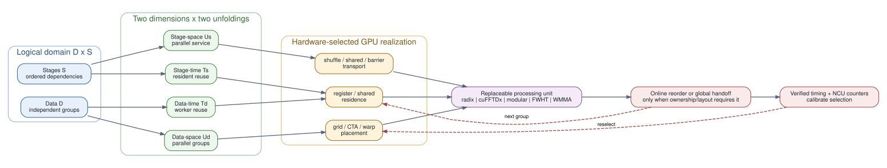

# cuButterfly

**Hardware-mapped space-time parallelism for butterfly computations on GPUs.**

[](https://github.com/TruNcat3/cuButterfly/actions/workflows/repository-checks.yml)
[](https://github.com/TruNcat3/cuButterfly/releases/latest)
[](LICENSE)

cuButterfly is a CUDA research prototype that generalizes the
space-time parallel paradigm from NTT to regular layered transforms. It keeps
the architecture-level mapping independent of the local arithmetic core, so
FFT, NTT, FWHT, and XOR-zeta can share one mapping vocabulary while selecting
different GPU realizations.

The repository contains working kernels, CPU references, a generated
processing-unit boundary, same-machine library comparisons, Nsight profiling
scripts, and the raw CSV data used in the reports. It is a research artifact,
not a drop-in replacement for cuFFT or a production cryptography library.

## Core Idea

A regular butterfly graph exposes two logical dimensions: stage and independent
data unit. cuButterfly unfolds both dimensions in space and time:

```text
M = (Us, Ts, Ud, Td, Ub, Tb, Hs, Rs, Rd, Rb, L, F, Q)

Us, Ts  stage-space and stage-time unfolding
Ud, Td  data-space and data-time unfolding
Ub, Tb  batch-space and batch-time unfolding
Hs      physical service for spatial stage edges
Rs/Rd/Rb residence across stage, data, and batch folds
L       input, intermediate, and output layout policy
F, Q    kernel family and hardware realization parameters
```



The editable Graphviz source is
[`figures/cubutterfly_concept.dot`](figures/cubutterfly_concept.dot).

The processing unit may change without changing the paradigm. Conversely, a
good codelet does not determine its block shape, residency, permutation policy,
or cross-kernel schedule. These are searched against the current GPU.

Read [Complete Butterfly Design Space](docs/butterfly_design_space.md) for the
canonical model, [Design Overview](docs/design_overview.md) for the concise view, and
[Hardware Mapping Methodology](docs/hardware_mapping_methodology.md) for the
resource equations and counter-driven selection procedure.

## Implemented Scope

| Operator | Numeric forms | Processing-unit candidates | Mapping families |
|:--|:--|:--|:--|
| NTT | 32/64-bit words, compatible primes below `2^63` | radix-2/4/8, Shoup, Barrett, fused coset twiddles | baseline, local tile, Hybrid2D, compact stage, stage pipeline |
| FFT | FP32, FP64, FP16 input with FP32 accumulation | radix-2/4/8, four-multiply, Gauss-3, thread/CTA/WMMA DFT8 | temporal tile, hierarchical, online reorder, warp hybrid, stage pipeline |
| FWHT | FP32, FP64 | radix-2/4/8, shared and warp-register exchange | temporal tile, hierarchical, online reorder, warp hybrid, stage pipeline |
| XOR-zeta | uint32 | radix-2/4/8 | temporal tile, hierarchical, online reorder, warp hybrid, stage pipeline |

Power-of-two lengths, batches, forward/inverse execution, normalization,
in-place/out-of-place placement, padded batches, and strided elements are
covered where listed in the [Feature Matrix](docs/cubutterfly_feature_coverage.md).
Unsupported generated combinations fail explicitly rather than falling back to
another core.

## Selected V100 Results

All values below are resident kernel times measured on one Tesla
V100-SXM2-16GB with CUDA 11.8. Each comparison matches the documented shape,
precision, direction, layout, and warmup protocol. Ratios above `1.0x` mean
cuButterfly has higher throughput. They must not be generalized to other GPUs.
For the latest controlled cross-workload protocol and its complete evidence
boundary, use the [V100 Comprehensive Results](docs/comprehensive_v100_results.md);
the focused rows below retain their original experiment protocols. The newer
[orthogonal length/batch scan](docs/v100_scaling_results.md) shows that parity
is shape-dependent: the best processing unit and the relative library result
can change as batch exposes additional hardware concurrency.
The measured [FFT pipeline generator](docs/fft_pipeline_generator.md) turns
that observation into a processing-unit, mapping, and runtime-dispatch flow.

### Same-Machine Library Comparisons

| Workload | cuButterfly | Reference | Throughput ratio | Evidence |
|:--|--:|--:|--:|:--|
| FP32 DFT8, `2^22` total points | 0.093420 ms | cuFFT 0.086323 ms | 0.924x | generated CTA DFT8 |
| FP32 FFT, `logN=12`, `2^22` total points | 0.088934 ms | cuFFT 0.089989 ms | 1.012x | contiguous cuFFTDx direct unit |
| FP32 FFT, `logN=14`, `2^22` total points | 0.131543 ms | cuFFT 0.135383 ms | 1.029x | contiguous cuFFTDx direct unit |
| FP32 FFT, `logN=18`, `2^22` total points | 0.212019 ms | cuFFT 0.226877 ms | 1.070x | `9+9`, independently tuned 256/256-thread dimensions |
| FP32 FFT, `logN=20`, `2^22` total points | 0.235971 ms | cuFFT 0.209521 ms | 0.888x | cuFFTDx two-pass composition |
| FP32 FWHT, `logN=8` | 0.043131 ms | Dao FHT 0.043172 ms | 1.001x | integrated register unit |
| FP32 FWHT, `logN=15` | 0.069243 ms | Dao FHT 0.063949 ms | 0.924x | register-pressure boundary |
| 60-bit NTT, `logN=16`, natural order | 0.274104 ms | GPU-NTT 0.291133 ms | 1.062x | fused Hybrid2D |
| 60-bit NTT, `logN=20`, native bit-reversed | 0.341320 ms | GPU-NTT 0.396186 ms | 1.161x | compact-stage mapping |

The generated local core and tiled two-pass composition raise long FFT
throughput from 32.7%-47.4% to 41.9%-88.8% of cuFFT. Whole-transform cuFFTDx
units at `logN=11..14` isolate the local-unit ceiling: the contiguous paths at
`logN=11,12,14` reach 1.006x, 1.012x, and 1.029x cuFFT throughput, while
`logN=13` reaches 0.965x. Independently tuning the two long-transform dimensions
also raises `logN=18` from 0.881x in the fixed-512 mapping experiment to 1.070x.
Processing-unit granularity and each dimension's CTA shape are therefore explicit
hardware-mapping axes rather than fixed properties of the paradigm.

### Online Reorder at `logN=20`

| Operator | Hierarchical | Online reorder | Speedup |
|:--|--:|--:|--:|
| FWHT FP32 | 0.488264 ms | 0.319795 ms | 1.527x |
| FFT FP32 | 1.199616 ms | 0.640174 ms | 1.874x |
| FFT FP32, cuFFTDx core | 1.199616 ms | 0.235971 ms | 5.084x |
| XOR-zeta uint32 | 0.487004 ms | 0.319519 ms | 1.524x |

The permutation is fused into an already-required boundary store. It is not
assumed free: the destination transaction pattern and suffix residency are
measured separately. See [Experimental Results](docs/experiments.md) and the
[raw results directory](results/).

Targeted [V100 counter attribution](docs/v100_ncu_attribution.md) shows why
occupancy alone is insufficient: the long online FFT paths expose as many or
more active warps than cuFFT, but execute 1.60x-2.00x the warp instructions and
about 9.4x-9.5x the shared-memory bank conflicts at the measured large-batch
points. The mapping method therefore separates grid coverage, residency, and
useful work per resident warp.

## Quick Start

Requirements: Linux, CMake 3.20+, a C++17 compiler, and the CUDA Toolkit.
The default build targets `sm_70`; set the architecture for another GPU.

```bash
git clone https://github.com/TruNcat3/cuButterfly.git
cd cuButterfly

cmake -S . -B build \
  -DCMAKE_BUILD_TYPE=Release \
  -DCMAKE_CUDA_COMPILER=/usr/local/cuda-11.8/bin/nvcc \
  -DCMAKE_CUDA_ARCHITECTURES=70
cmake --build build -j
cmake --build build --target test
```

Run representative verified workloads:

```bash
# NTT: V100 Hybrid2D mapping
./build/cuntt_bench --logN 16 --batch 64 --backend hybrid2d \
  --compute-unit radix4 --cross-twiddle fused --verify

# FWHT: generated warp-register processing unit
./build/cubutterfly_bench --operator fwht --backend temporal-tile \
  --local-exchange warp-register --precision fp32 \
  --logN 15 --batch 128 --verify

# FFT: generated CTA DFT8 mapping
./build/cubutterfly_bench --operator fft --backend temporal-tile \
  --fft-core cta-dft8 --precision fp32 --compute-unit radix8 \
  --tile-threads 32 --logN 3 --batch 524288 --verify

# Inspect the compiled capability matrix
./build/cubutterfly_bench --list-capabilities
```

Detailed build, API, benchmark, profiler, and data-reduction commands are in
[Getting Started](docs/getting_started.md) and
[Reproducibility](docs/reproducibility.md).

If several CUDA toolkits are installed, explicitly select the intended `nvcc`.
CUDA 11.5 with GCC 11 is not a supported toolchain combination for this
artifact; the clean-clone validation uses CUDA 11.8 with GCC 11.

## Repository Guide

| Path | Purpose |
|:--|:--|
| `include/cuntt/` | public NTT and common butterfly plan APIs |
| `src/` | CUDA runtime, mappings, processing units, and CPU references |
| `config/`, `configs/` | generated-unit choices, GPU profiles, and mapping descriptors |
| `apps/` | benchmark and hardware microbenchmark executables |
| `tests/` | correctness and semantic coverage |
| `scripts/` | sweeps, summarizers, plotting, NCU, and Nsight Systems workflows |
| `results/` | measured V100 CSV data and counter analyses |
| `docs/` | architecture, implementation, experiments, and research positioning |

Start with the [Documentation Index](docs/README.md). Candidate processing
units and future implementation paths are catalogued in
[Candidate Implementations](docs/implementation_candidates.md).
Development priorities are tracked in [`ROADMAP.md`](ROADMAP.md), and evidence
requirements for contributions are in [`CONTRIBUTING.md`](CONTRIBUTING.md).
Versioned changes are recorded in [`CHANGELOG.md`](CHANGELOG.md).
The active research milestone and its acceptance criteria are in
[Next Phase: v0.3.0](docs/next_phase_v0.3.md).

## Evidence Boundary

- V100 is the only fully measured GPU generation in this revision. A100, H100,
  and RTX 4090 entries are placeholders, not performance claims.
- FP32 FFT reaches cuFFT parity at selected `logN=8,14,18` shapes. At large
  batch, cuFFT has a higher `logN=18` throughput ceiling; the measured
  `logN=20` and FP64 `logN=16` paths remain behind. Tensor Core DFT8 helps the
  local unit but does not remove layout, synchronization, and composition
  costs.
- FWHT closely tracks Dao FHT after importing its validated local register
  hierarchy. This demonstrates processing-unit reuse, not independent invention
  of that core.
- NTT comparisons pin modulus, output order, batch, library revision, and
  resident timing. Natural and native bit-reversed results are not mixed.
- XOR-zeta currently has no external tuned-library baseline.

The full claim and relationship to prior systems are in
[Research Positioning](docs/cubutterfly_positioning.md).

## Citation

Use the repository's [`CITATION.cff`](CITATION.cff), or cite the current
software release as:

```bibtex
@software{cubutterfly_2026,
  author  = {TruNcat3},
  title   = {cuButterfly: Hardware-Mapped Space-Time Parallelism for Butterfly Computations on GPUs},
  year    = {2026},
  version = {0.2.0},
  url     = {https://github.com/TruNcat3/cuButterfly}
}
```

Third-party provenance and license text for the adapted FWHT processing unit
are recorded in [`THIRD_PARTY_NOTICES.md`](THIRD_PARTY_NOTICES.md). No paper
DOI is claimed by this repository revision.
