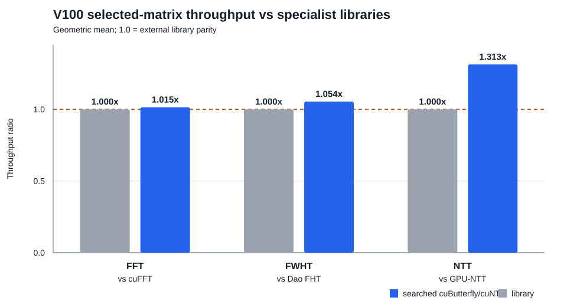

# cuButterfly

**Hardware-mapped space-time parallelism for regular butterfly computations on GPUs.**

[](https://github.com/TruNcat3/cuButterfly/actions/workflows/repository-checks.yml)
[](LICENSE)

cuButterfly is a CUDA research library and reproducible artifact for FFT, NTT,
FWHT, structured 2x2, and subset/superset zeta transforms. The project studies
an architecture mapping problem rather than one fixed kernel: the same layered
butterfly graph is unfolded across data and stage dimensions, then lowered to a
hardware-appropriate processing unit.

> **Release status:** v0.8 is a temporarily frozen V100 research baseline. It
> is suitable for reproducing the documented experiments and extending the
> mapping space. Cross-GPU calibration remains future work.

## Read This Repository In Order

1. **Orient yourself:** read this page through the two figures below and the
   [v0.8 release overview](docs/release_v08.md).
2. **Use the library:** follow [Getting Started](docs/getting_started.md),
   then the [Programming Guide](docs/programming_guide.md) and [C Plan API](docs/c_api.md).
3. **Understand the method:** read [Design Overview](docs/design_overview.md),
   [Hardware Mapping Methodology](docs/hardware_mapping_methodology.md), and
   [v0.8 Nested Physical Space](docs/v0.8_nested_physical_space.md).
4. **Understand the design space:** read [Architecture Guardrails](docs/architecture_guardrails.md),
   [Processing-Unit Design Space](docs/processing_unit_design_space.md), and
   [Runtime Selector](docs/runtime_selector.md).
5. **Reproduce and audit:** use [Hardware Profile Initialization](docs/hardware_profile_install.md),
   [Reproducibility](docs/reproducibility.md), and the [comparison evidence](docs/v100_three_way_comparison.md).

The complete map, including older experiment notes and generated artifacts, is
maintained in the [documentation index](docs/README.md).

## Core Idea

The mapping layer and the arithmetic core are deliberately separate:

```text
layered graph
    |  data-space/time + stage-space/time unfolding
    v
architecture mapping (residence, pipeline, layout, ownership)
    |  processing-unit selection and lowering contract
    v
radix / modular / warp / cuFFTDx / generated local core
    |  hardware profile + measured performance model
    v
selected plan for (GPU, operator, precision, length, batch, layout)
```

The four primary factors are:

```text
data work   D = Ud * Td       stage work   S = Us * Ts
Ud, Us: spatial replication;  Td, Ts: temporal reuse
```

They are workload- and hardware-dependent parameters, not fixed tile sizes.
Residence, boundary layout, synchronization, physical execution groups, and
the local processing unit are additional explicit design-space dimensions.
The conceptual figure is available as
[`figures/cubutterfly_concept.svg`](figures/cubutterfly_concept.svg), with
editable Graphviz source in
[`figures/cubutterfly_concept.dot`](figures/cubutterfly_concept.dot).

<p align="center">
  
</p>

**How to read the architecture figure:** the graph dimensions are unfolded
independently; residence, transport, ownership, and boundaries are selected
after the unfolding; the arithmetic core is replaceable; measurement feeds
back into plan selection. This is the architecture claim, not a claim that
every local arithmetic unit is newly invented here.

## What Is Frozen In v0.8

| Area | Current evidence boundary |
|:--|:--|
| Architecture | v0.6-compatible GridTiled mappings, resident physical groups, mixed-dataflow roles, and independent processing-unit lowering are represented explicitly. |
| Operators | FFT, NTT, FWHT, Structured 2x2, subset/superset zeta, and legacy xor-zeta paths are implemented with documented contracts. |
| Selection | V100 confirmed cells are compiled into the runtime selector; exact measured cells report `confirmed-median`, while uncovered cells fall back to calibrated/model behavior. |
| Performance | Many non-FFT resident points exceed the mature v0.6 path. FFT reaches cuFFT parity or better for selected shapes, while saturated long-batch FFT points remain below cuFFT. |
| Portability | V100 is the only fully measured GPU. A100/H100/RTX and other cards are placeholders, not performance claims. |

Representative long-FFT three-way results are shown below; ratios above 1 mean
cuButterfly has lower kernel time than cuFFT.

| Shape | v0.6 (ms) | v0.8 (ms) | cuFFT (ms) | v0.8/cuFFT |
|:--|--:|--:|--:|--:|
| FP32 logN18, batch 2 | 0.029778 | 0.029819 | 0.031683 | 1.063x |
| FP32 logN18, batch 64 | 0.812708 | 0.769270 | 0.707174 | 0.919x |
| FP32 logN20, batch 2 | 0.119460 | 0.119972 | 0.121467 | 1.012x |
| FP32 logN20, batch 16 | 0.827249 | 0.767611 | 0.724091 | 0.943x |

These are matched V100 measurements, not universal claims. The complete
protocol, external-baseline coverage, raw CSV paths, and limitations are in
the [v0.8 release overview](docs/release_v08.md).

### External-library summary

The following compact view summarizes the selected V100 matrix in
[`results/v100_three_way_comparison.md`](results/v100_three_way_comparison.md).
Each gray bar is the matched specialist-library baseline; each blue bar is the
searched cuButterfly/cuNTT throughput ratio. A value of `1.0x` means parity.

<p align="center">
  
</p>

This is a representative matched matrix, not an all-shapes guarantee. FFT and
FWHT have four and three shapes respectively; NTT uses three archived
matching-protocol rows. Saturated long-batch FFT gaps and unsupported external
operator baselines remain explicitly documented.

The figure is reproducible with:

```bash
python3 scripts/generate_readme_performance_figure.py
```

## Quick Start

Requirements: Linux, CMake 3.20+, C++17, CUDA Toolkit 11.8 or a compatible
toolchain, and a GPU architecture supported by the selected build.

```bash
git clone https://github.com/TruNcat3/cuButterfly.git
cd cuButterfly
cmake -S . -B build \
  -DCMAKE_BUILD_TYPE=Release \
  -DCMAKE_CUDA_COMPILER=/usr/local/cuda-11.8/bin/nvcc \
  -DCMAKE_CUDA_ARCHITECTURES=70
cmake --build build -j
ctest --test-dir build --output-on-failure
```

Run a verified workload:

```bash
./build/cubutterfly_bench --operator fwht --backend temporal-tile \
  --local-exchange warp-register --precision fp32 \
  --logN 15 --batch 128 --verify

./build/cuntt_bench --logN 16 --batch 64 --backend hybrid2d \
  --compute-unit radix4 --cross-twiddle fused --verify
```

For the public plan API, device-pointer integration, workspace ownership,
selection logs, and supported combinations, start with:

- [Getting Started](docs/getting_started.md)
- [Programming Guide](docs/programming_guide.md)
- [C Plan API](docs/c_api.md)
- [Capability Matrix](docs/support_matrix.md)

For a new machine, use the [Hardware Profile Initialization](docs/hardware_profile_install.md)
flow after selecting the CUDA architecture. It automatically measures local
GPU service rates and writes a device-specific model table; do not copy the
V100 table to another GPU.

## Documentation

The [documentation index](docs/README.md) preserves the reading order above
and separates the detailed material into four paths:

1. **Use the library:** build, plans, streams, layouts, workspaces, errors, and examples.
2. **Understand the method:** design overview, hardware mapping, physical-chain model, and processing-unit lowering.
3. **Reproduce results:** V100 protocols, cross-operator matrices, Nsight scripts, raw data, and evidence labels.
4. **Read the release:** [v0.8 freeze overview](docs/release_v08.md), research status, positioning, changelog, and roadmap.

The most important architecture documents are [Design Overview](docs/design_overview.md),
[Architecture Guardrails](docs/architecture_guardrails.md),
[Hardware Mapping Methodology](docs/hardware_mapping_methodology.md),
[v0.8 Nested Physical Space](docs/v0.8_nested_physical_space.md), and
[Processing-Unit Design Space](docs/processing_unit_design_space.md).

## Evidence And Scope

All performance statements must identify the GPU, operator, precision or
modulus, length, batch, direction, placement, output order, timing boundary,
and trial protocol. The repository distinguishes:

| Label | Meaning |
|:--|:--|
| `measured` | Direct timing or counter data from a checked-in command. |
| `derived` | A value calculated from measured data using a stated equation. |
| `external` | A pinned third-party implementation under a matched protocol. |
| `placeholder` | A schema or future hardware slot without a performance claim. |

cuButterfly should not be described as universally faster than cuFFT, Dao FHT,
GPU-NTT, or every specialist library. Current external comparisons are sparse
and workload-specific; Structured and Zeta do not yet have an equivalent
external CUDA baseline in this repository. The defensible claim is that one
architecture-level mapping and search framework reaches parity or leadership
across many measured V100 butterfly workloads while preserving explicit
fallbacks and correctness contracts.

## Citation

Please cite the software and its experimental data using
[`CITATION.cff`](CITATION.cff). BibTeX:

```bibtex
@software{wang_cubutterfly_2026,
  author  = {Teng Wang},
  title   = {cuButterfly: Hardware-Mapped Space-Time Parallelism for Butterfly Computations on GPUs},
  year    = {2026},
  version = {0.8.0},
  url     = {https://github.com/TruNcat3/cuButterfly}
}
```

Author: **Teng Wang**, High Efficient Intelligent Computing Lab, Suzhou
Institute for Advanced Research of USTC, Suzhou, China.

## License

The repository is released under the [BSD 3-Clause License](LICENSE). You may
use, modify, and redistribute the source or binary forms, provided that the
copyright notice, license conditions, and disclaimer are retained. Adapted
third-party code remains subject to its own notice in
[`THIRD_PARTY_NOTICES.md`](THIRD_PARTY_NOTICES.md).
