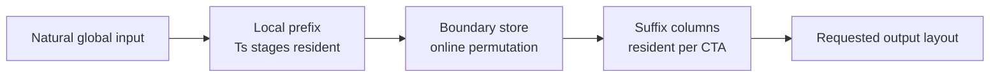

# Design Overview

## 1. Problem Class

cuButterfly targets transforms whose dependency graph is a regular sequence of
binary stages. For `N=2^m`, stage `s` contains `N/2` independent butterfly
updates. FFT and NTT attach stage coefficients, FWHT uses add/subtract, and
XOR-zeta changes the pair operator, but their dependency topology is shared.

The project separates five objects:

```text
G: mathematical graph and exact transform semantics
A: architecture-level space-time mapping
P: replaceable processing unit
F: concrete GPU kernel realization
B: complete external library baseline
```

This separation is essential. A faster complex multiply belongs to `P`; block
shape, state residency, and online layout conversion belong to `A` and `F`.
cuFFT remains `B` unless a local unit can be isolated without importing its
complete scheduler.

## 2. Four Unfolding Factors

Let `S` be the number of stage positions and `D` the independent data work.
The logical iteration space is factorized as:

```text
S = Us * Ts
D = Ud * Td
```

| Factor | Meaning | Typical GPU effect |
|:--|:--|:--|
| `Us` | stage-space unfolding | more simultaneous stage services, barriers, or warp roles |
| `Ts` | stage-time folding | more dependent stages retained in registers/shared memory |
| `Ud` | data-space unfolding | more lanes, warps, CTAs, and memory-level parallelism |
| `Td` | data-time folding | more independent items reused by each physical worker |

These factors are not fixed tile dimensions. Legal and efficient values depend
on the current GPU's register file, shared-memory partition, barrier service,
warp size, SM count, cache, and global-memory system.

## 3. Expanded Mapping Descriptor

The four factors alone cannot distinguish two mappings with different storage
or handoff costs. cuButterfly uses:

```text
M = (Us, Ts, Ud, Td, Hs, Rs, Rd, L, F, Q)
```

| Field | Role |
|:--|:--|
| `Hs` | physical transport for a spatial stage edge: register, shuffle, shared memory, named barrier, or global handoff |
| `Rs` | residence level across stage-time folds |
| `Rd` | residence level across data-time folds |
| `L` | bank mapping, input order, intermediate permutation, and output order |
| `F` | temporal tile, Hybrid2D, online reorder, stage pipeline, or another kernel family |
| `Q` | threads, rows, local stages, radix, columns, warps, and generated-core selection |

This descriptor explains why two kernels with identical `(Us,Ts,Ud,Td)` can
have very different performance: one may keep a boundary in shared memory,
while another writes the same boundary to global memory.

## 4. Online Reordering

When a long transform is split into prefix and suffix groups, the prefix output
layout determines whether suffix dependencies are contiguous. cuButterfly can
write prefix result `(h,l)` directly to physical address `(l,h)` at the
required boundary store.



The integer address calculation is small, but the operation is not declared
free. Destination coalescing, shared-memory bank mapping, cache sectors, and the
number of eliminated later passes determine whether it wins. The V100 results
show both positive cases and a CTA DFT8 case where a bit-reversed shared store
was slower than paying one extra barrier.

## 5. Replaceable Processing Units

A local processing unit is described independently:

```text
P = (stage_group, arithmetic_core, coefficient_form, local_exchange)
```

- `stage_group`: radix-2, fused radix-4, fused radix-8, or matrix codelet.
- `arithmetic_core`: modular, complex, add/subtract, or semiring update.
- `coefficient_form`: native, Shoup, Barrett, generated matrix, or another
  precomputed representation.
- `local_exchange`: register, warp shuffle, shared memory, or an imported local
  hierarchy.

The same architecture search can therefore absorb a validated processing unit
without claiming it as a new arithmetic invention. This is demonstrated by the
Dao-derived FWHT register hierarchy and by generated scalar/CTA/WMMA DFT8
choices.

## 6. Selection Procedure

1. Fix exact semantics: operator, precision or modulus, length, batch,
   direction, normalization, placement, strides, and output order.
2. Enumerate legal `(A,P,F,Q)` candidates from the GPU profile and build-time
   design specification.
3. Reject candidates exceeding register, shared-memory, thread, layout, or
   numeric constraints.
4. Predict the dominant demand: arithmetic, global traffic, local exchange,
   synchronization, or occupancy.
5. Benchmark the reduced set with identical resident timing and verification.
6. Use NCU/NSYS counters to classify the remaining gap and update the profile.
7. Record the selected mapping per GPU rather than promoting it to an
   architecture constant.

The executable resource model and equations are detailed in
[Hardware Mapping Methodology](hardware_mapping_methodology.md).

## 7. Current Research Claim

The current artifact supports the following claim: a common layered-transform
mapping vocabulary survives changes in operator and local processing unit, and
hardware-dependent choices materially change the selected design point.

It does not yet establish an automatic selector across GPU generations or
universal superiority over specialized libraries. Those require the same
prediction-and-measurement protocol on at least one additional GPU family.
