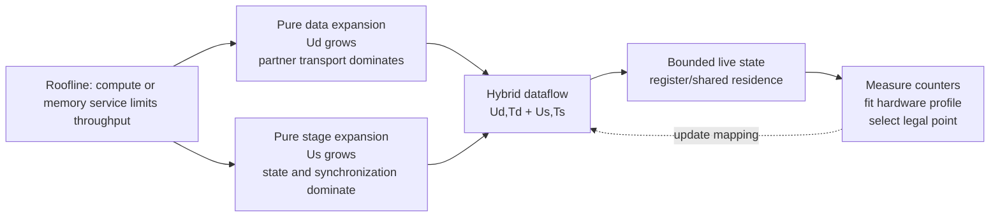
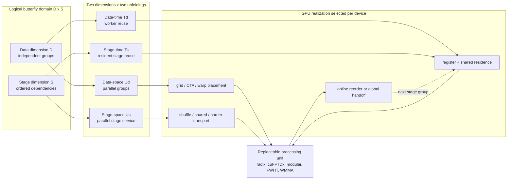
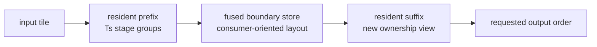

# Design Overview

## 1. Why A Mapping Paradigm Is Needed

FFT, NTT, FWHT, and XOR-zeta use different arithmetic, but their regular
power-of-two forms share the same dependency graph. For `N=2^m`, each stage
contains independent butterfly updates; an element produced at stage `s` is
consumed by a prescribed partner at stage `s+1`. A GPU implementation must
therefore answer two different questions:

1. how much independent data work should execute concurrently; and
2. how many dependent stage groups should remain on chip before ownership or
   layout changes.

Specialized libraries often answer both questions inside one highly tuned
kernel. That is effective for one operator and device, but it entangles the
arithmetic codelet with scheduling, storage, synchronization, and layout.
cuButterfly separates them. Its contribution is the architecture-level
organization of the dependency graph; a radix codelet, modular reduction,
cuFFTDx block, register FWHT, or register Structured hierarchy remains a replaceable physical
processing unit.

This separation is also the portability model. A plan is selected for a
semantic workload and hardware target, not for the operator name alone:

```text
(GPU, operator, precision, length, batch, direction, layout)
    -> architecture mapping + processing-unit choice + lowering contract
```

Different lengths of the same operator may therefore use different stage
partitions, data-time reuse, residence, and arithmetic cores. Different
operators at the same length may use different cores as well. Cross-GPU
deployment requires a new capability/calibration table; a point validated on
V100 is not silently reused as an optimum on another GPU.

The separation is represented by seven objects:

```text
G: mathematical graph and exact transform semantics
A: architecture-level space-time mapping
P: replaceable processing unit
L: global and intermediate layout
F: concrete GPU kernel realization
Q: generation, selection state, and objective
H: target hardware capacities and service rates
```

A complete external library is a baseline, not a processing unit, unless its
local codelet can be isolated from its scheduler and measured under the same
contract.

## 1.1 Why The Mapping Is Hybrid

The four-factor mapping is not a collection of convenient CUDA knobs. It
follows from a bottleneck argument that applies to regular butterfly graphs,
including the NTT formulation in the [APPT/Hermes work](appt_static_layout.md).

### Step 1: Start With The Roofline Question

For one workload, let `W` be executed arithmetic work, `Q` the bytes moved
through the limiting memory level, and `I = W/Q` the arithmetic intensity. A
first-order upper bound is:

```text
attainable throughput <= min(compute_peak, memory_bandwidth * I)
```

Butterflies have regular arithmetic and partner exchange, but their arithmetic
per value is bounded. Once the working set or intermediate boundaries leave the
register/shared-memory hierarchy, extra arithmetic units do not compensate for
the additional movement. The optimization question is therefore not simply
“how many threads can be launched?” It is “which dependency edges can be
served at which memory and synchronization level while keeping the arithmetic
units fed?”

### Step 2: Why Pure Data-Space Expansion Is Not Sufficient

Expanding `Ud` exposes more independent butterflies and is the natural first
GPU mapping. It stops scaling when the next stage needs partner values that are
owned by a different lane, warp, or CTA. The implementation must then pay for
shuffle/shared transport, a barrier, or a global boundary. Increasing `Ud`
also widens boundary transactions and the live state needed to keep all those
groups in flight. Thus dependence does not make the whole transform serial;
it limits how much *independent data work* can be expanded before transport and
boundary service, rather than arithmetic, becomes the roofline limiter.

### Step 3: Why Pure Stage-Space Expansion Is Not Sufficient

Expanding `Us` keeps more dependent stages resident and can reduce stage-time
folds. However, every resident stage needs state, coefficient/twiddle supply,
and a legal handoff path. Beyond a device-dependent point, the extra stage
replication increases register/shared-memory footprint, lowers CTA residency,
and adds inter-stage synchronization or bank pressure. If stage groups are
split across ownership domains, the saved stage fold is replaced by an
intermediate read/write. Pure stage expansion therefore trades fewer logical
folds for a larger working set and more transport; it is not a free increase in
pipeline throughput.

### Step 4: The Required Compromise Is Two-Dimensional And Space-Time

The useful design must expose independent data work while reusing a bounded
stage service, and expose stage work while reusing a bounded data tile:

```text
data:  D = Ud * Td       stage:  S = Us * Ts
         replicate/reuse          replicate/reuse
```

`Ud` and `Us` determine what is concurrent. `Td` and `Ts` determine what is
reused by the same physical workers. A mixed-dataflow realization assigns
dependency-closed subgraphs to roles, keeps the legal portion resident in
registers/shared memory, transports only the required edge values, and uses
online reordering at a boundary when the consumer's layout differs. This
balances four services that the roofline alone cannot collapse into one number:
arithmetic issue, data movement, dependency transport, and live-state
capacity.



This is also why the smallest conceptual unit is not a fixed radix kernel. It
is a mapping tuple such as
`(Us, Ts, Ud, Td, layout, residence, pipeline, processing_unit)`. A better
radix, FFT codelet, or modular reducer can be substituted after the graph has
been mapped; the mapping remains the object being studied.

### Step 5: What The Prior-Work Review Adds

The review behind this project found strong local solutions, but not one
common, exposed analysis that connects all of these choices for every regular
butterfly operator. cuFFT, cuFFTDx, TurboFFT, Dao FHT, GPU-NTT, and related
systems provide valuable specialized kernels or plans. FFTW/SPIRAL and
architecture-modeling tools provide complementary generation or cost-model
ideas. Their optimization boundaries differ: a local codelet, an operator
plan, an affine schedule, or a hardware model. The gap motivating cuButterfly
is a shared mapping vocabulary that makes dependence, residence, handoff,
layout, and arithmetic-core choice comparable across FFT, NTT, FWHT, and zeta
graphs. This is a scope statement about the project's review, not a claim that
those systems lack internal scheduling analysis.

### Step 6: Analysis Must Close The Loop

The reasoning is used operationally rather than left as motivation:

1. Roofline estimates identify whether a candidate is likely compute-, memory-,
   transport-, or state-limited.
2. Legality checks reject mappings that exceed registers, shared memory, CTA
   shape, synchronization, or numeric constraints.
3. A small hardware-specific calibration set measures the predicted services
   (for example bank conflicts, global sectors, occupancy, and barrier stalls).
4. The selector chooses among the remaining mappings and processing units for
   the requested operator, precision, length, batch, and layout.

Consequently, a V100 result is evidence for a V100 mapping point, not a
universal tile recipe. The same argument can be re-evaluated on another GPU by
rebuilding its capability and service-rate profile.

## 2. Two Logical Dimensions, Four Unfolding Factors

Let `D` denote independent butterfly data groups and `S` denote the ordered
stage positions. The core logical iteration domain is the product `D x S`.
cuButterfly factorizes each dimension into a spatial part and a temporal part:

```text
D = Ud * Td
S = Us * Ts
```

`Ud` and `Us` are physical replication: they spend parallel hardware to expose
work at the same time. `Td` and `Ts` are physical reuse: they let the same
hardware serve multiple logical positions over time. These are architecture
factors, not fixed CUDA tile sizes.



The four factors place different demands on the GPU:

| Factor | Architectural question | Typical GPU realization | Main limiting services |
|:--|:--|:--|:--|
| `Ud` | How many independent data groups execute now? | lanes, warps, CTAs, grid waves | thread slots, memory concurrency, transaction shape |
| `Td` | How many data groups reuse one physical worker? | per-thread items, CTA loops, repeated batch tiles | register lifetime, shared capacity, instruction count |
| `Us` | How much stage service is physically replicated? | lane roles, warp roles, local pipelines, grouped codelets | shuffles, barriers, shared ports, code size |
| `Ts` | How many dependent stages reuse that service? | register-resident or CTA-resident stage loops | state capacity, synchronization, coefficient supply |

Batch does not add a new dependency dimension. It contributes more independent
points to `D`. The implementation may still expose `Ub` and `Tb` to distinguish
batch-space and batch-time scheduling, but both refine the data-dimension
mapping rather than changing the two-dimensional graph model.

## 3. What Spatial And Temporal Mean On A GPU

Data-space unfolding is dependency-free: different transforms or independent
groups can be assigned to different lanes, warps, or CTAs without synchronizing
with one another. Stage-space unfolding is different. Adjacent stage work may
be placed in different physical roles, but dependency edges still require an
explicit transport and, when producer and consumer are not warp-synchronous, a
synchronization mechanism.

Temporal unfolding means reuse, not a promise that every value stays in a
register. Thread-private state can remain in registers; values exchanged by a
CTA normally reside in shared memory; state crossing CTA ownership requires a
cooperative launch mechanism or a global-memory boundary. `Td` and `Ts`
describe which logical work reuses a physical resource, while the residence
fields describe where its live state is held.

This distinction prevents two common but incorrect conclusions:

- a larger temporal factor is not automatically better, because longer live
  ranges can reduce occupancy or exceed shared-memory capacity;
- a single source-level CUDA function does not remove grid-wide dependency
  boundaries, because ordinary CTAs cannot safely synchronize with each other.

## 4. Residence, Transport, And Layout

The four factors alone cannot distinguish mappings with different handoff
costs. The expanded mapping descriptor is:

```text
M = (Us, Ts, Ud, Td, Ub, Tb, Hs, Rs, Rd, Rb, L, F, Q)
```

`Hs` records how spatial stage edges are transported. `Rs`, `Rd`, and `Rb`
record residence across stage, data, and batch reuse. `L` records input,
intermediate, bank, and output layouts. `F` selects a kernel family, while `Q`
contains its concrete threads, rows, radix, segment lengths, and processing-unit
choices.

For a long transform, stage groups are chosen independently of physical kernel
groups. Several logical groups may be fused into one CTA-resident execution
group when capacity and dependency scope permit. A global pass is introduced
only when the next group needs a different ownership domain or cannot fit in
the current resident state.

## 4.1 Work Ownership Is A Separate Physical Axis

The four unfolding factors describe how logical work is exposed and reused;
they do not uniquely determine CUDA ownership. v0.8 therefore adds a physical
work-distribution axis after logical subgraphs have been lowered into execution
groups. `GridTiled` assigns dependency-closed tiles to ordinary CTAs,
`TransformResident` assigns a complete transform to one CTA, and
`ResidentQueue` lets a fixed cooperative CTA pool traverse ready subgraphs.
The native `10+10` realization publishes readiness at whole-transform scope,
because every second-group local NTT consumes rows produced across the complete
first group, while four-row consumer tasks remain independently assigned.

This axis is also independent from the processing unit. The same
`hybrid2d-radix4` codelet can be owned by GridTiled CTAs or by a ResidentQueue.
Within one ResidentQueue kernel, producer and consumer roles independently
select `hybrid2d-radix4` or `dataflow-radix4`; this exposed that the consumer
codelet, rather than the boundary layout, caused the first native performance
gap. That separation makes v0.6 Hybrid2D a strict v0.8 candidate instead of a
competing version-specific backend. The complete contract and current legality
limits are in [v0.8 Nested Physical Space](v0.8_nested_physical_space.md).

## 5. Online Reordering

After a resident stage group, the next group often needs a different view of
the same values. Writing the current result in the consumer's order performs
the permutation at an already-required handoff:



This is an online layout transformation, not a free permutation. It can remove
a later transpose and expose contiguous suffix work, but its address arithmetic,
coalescing, and shared-bank behavior must be measured. The V100 FP64 path is a
concrete example: recurrence reduced coefficient traffic, XOR swizzling reduced
bank conflicts, and strength-reduced address generation recovered the extra
integer and warp instructions introduced by the swizzle.

## 6. Replaceable Processing Units

A local unit is described independently from the mapping:

```text
P = (stage_group, arithmetic_core, coefficient_form, local_exchange)
```

The unit may use radix-2/4/8 composition, modular arithmetic, complex
four-multiply or Gauss-3, cuFFTDx, warp shuffles, shared memory, or a validated
external register hierarchy. Replacing it changes local latency, register use,
coefficient demand, and legal CTA shapes, so it changes the selected mapping.
It does not change the meanings of `Ud`, `Td`, `Us`, and `Ts`.

This boundary is why importing an established codelet strengthens rather than
weakens the architecture experiment: the same mapper can test whether a better
local unit remains efficient once embedded in a long-transform dataflow.

## 7. Hardware-Driven Selection

Selection proceeds from semantics to hardware rather than from a universal
tile constant:

1. Fix operator, precision or modulus, length, batch, direction,
   normalization, placement, strides, and output order.
2. Enumerate legal graph factorizations, four-factor mappings, residence and
   layout choices, and processing units.
3. Derive per-candidate register/shared/thread/warp CTA limits; reject only
   hardware-infeasible, layout-infeasible, or numerically invalid points.
4. Retain temporal state/thread, resident CTAs and warps, occupancy upper bound,
   grid waves, limiting resource, and adjacent-point resource-cliff features.
   A cliff expands the nearby decomposition/core search rather than pruning the
   resident point automatically.
5. Measure a reduced calibration set and dispatch among the remaining
   candidates.
6. Use NCU/NSYS to test the predicted limiting service and update the hardware
   profile.

Static constraints provide legality and a shortlist, but do not capture every
launch-limited crossover. On V100, a small measured calibration set reduces
the FFT selector's top-3 geometric-mean regret to `1.0007x`; this is why the
current method is counter-calibrated rather than presented as a purely analytic
cost model.

The full resource equations are in [Hardware Mapping
Methodology](hardware_mapping_methodology.md), and the complete separation of
graph, mapping, unit, layout, realization, and selector is specified in
[Complete Butterfly Design Space](butterfly_design_space.md).

## 8. Current Claim Boundary

The experimental NTT [Hybrid Dataflow backend](hybrid_dataflow_ntt.md) is the
first strict realization of fixed-size subgraph streaming across both stage and
data dimensions. It is separated from the older StagePipeline baseline so that
the architectural contribution can be tested against subkernel time reuse.

The artifact demonstrates on V100 that one mapping vocabulary survives changes
in operator and processing unit, that the best factorization changes with
length, batch, and precision, and that counter-guided changes predict measured
performance improvements. It does not yet establish cross-generation selector
transfer, non-power-of-two coverage, or universal superiority over specialized
libraries. Those remain explicit evidence boundaries rather than assumptions.
