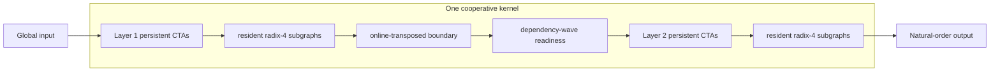
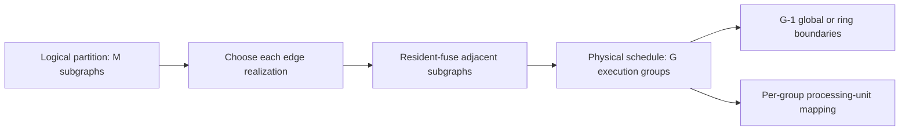
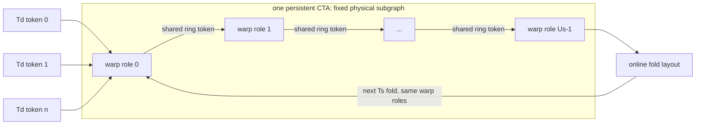

# Hierarchical Dataflow NTT

## Why A Second Dataflow Backend Exists

Strict `HybridDataflow` keeps one complete transform in one CTA. It proves that
stage-space and data-space reuse can form a resident graph, but shared memory is
CTA-private: once the transform state becomes large, one CTA cannot expose
enough intra-transform parallelism.

The old implementation is now named `HierarchicalBarrier`: it executes all
first-layer tasks, calls a grid-wide barrier, then executes all second-layer
tasks. `HierarchicalDataflow` now names the v0.7 implementation. It accepts an
arbitrary `stage_partition`, maps each fixed-size subgraph to persistent CTA
roles, and starts a consumer when its dependency wave is visible.



There is one grid synchronization at kernel entry to initialize counters. There
is no grid synchronization between computation segments. CTA roles are
interleaved in launch order so producer and consumer roles coexist in each
residency wave.

For adjacent digits `(B,C)`, a producer task fixes outer prefix `A` and
remainder `(C,D)`, while a consumer fixes `(A,B)` and `D`. All producers that
share `(A,D)` form one dependency wave: once every `C` task completes, all `B`
consumers in that wave are ready. Full-scratch mode therefore publishes one
counter per `(A,D)` wave instead of polling one token per coefficient.

This boundary is not a stage-by-stage spill. It is one full-size, globally
visible permutation between two resident layers, required because CUDA cannot
directly share CTA-local state. Cross-layer twiddles are fused into the second
layer's butterfly coefficients, so the boundary does not add an independent
modular multiplication per element.

## Mapping Parameters

For a transform with `logN = n1_log + n2_log`:

| Axis | Control | Hardware meaning |
|:--|:--|:--|
| resident stage space `U_s` | local layer length | two stages per radix-4 CTA barrier |
| graph time `T_s` | two cooperative layers | one grid-wide handoff rather than one launch per layer |
| subgraph data space `U_d` | `units_per_cta` | independent resident subgraphs owned by one CTA |
| subgraph data time `T_d` | `data_time` | subgraphs serially streamed by a persistent CTA |
| block residency `R_b` | `target_ctas_per_sm` | persistent grid size and achievable occupancy |
| physical width | `threads_per_block` | lane supply versus registers and shared-state pressure |

The descriptor path supports `M=2..8` ordered subgraphs with local logs in
`2..10` and `sum(stage_partition)=logN`; overall `logN=12..20` remains the API
range. The generic path maps one unit to a warp. Specialized resident kernels
expose `units_per_cta` independently from the logical stage partition; current
V100 instances cover `10+10` and the compiled permutations of `6+7+7` and
`6+6+8`. The physical unit is fused-Shoup resident radix-4. Automatic `R_b`
uses the exact compiled kernel's CUDA occupancy, while an impossible explicit
value is rejected.

`M` is deliberately not the number of global passes. Every logical edge has a
boundary realization: `full-scratch`, bounded `ring`, or `resident-fused`.
Adjacent subgraphs connected by resident-fused edges are lowered into one
physical execution group. If the lowering produces `G` groups, the runtime
descriptor contains `G` roles and only `G-1` materialized boundaries, while
the public plan still reports the original logical partition and its `M`
subgraph mappings. `execution_group_mappings` selects the physical codelet for
these lowered groups independently from the logical mappings.



Two physical radix-4 schedules are explicit at the `10+10` point:

- `dataflow-radix4` is the default unit developed with the persistent graph;
- `hybrid2d-radix4` imports the mature Hybrid2D coefficient reuse and index
  schedule as a generated ablation.

Both execute identical NTT arithmetic and use the same outer graph. They differ
only in the local instruction schedule and register live ranges.

The resident lowering control confirms this separation. Every logical
`M=2..8` candidate can lower to the same `G=2,10+10` schedule. Its measured
spread across M is at most 1.99% for batch 1/4/16. Holding that lowering fixed
and changing only the execution-group core from generic radix-4 to
`dataflow-radix4` improves median time by 2.88x/3.04x/3.25x. Thus M is not a
proxy for global passes, and processing-unit quality is not attributed to the
architecture-level factorization.

NCU closes the mechanism: resident G4-to-G2 lowering removes
2.56x--2.73x load sectors and 4.91x--5.01x warp instructions; physical-core
replacement removes a further 2.62x--2.64x load sectors, reduces registers
from 72 to 40, and nearly doubles active warps. M2/M4 counter deltas remain
within 1.27% after both lower to the same physical core.

## Relationship To Existing Backends

| Backend | launches | ownership | materialized internal boundaries | useful regime |
|:--|---:|:--|---:|:--|
| Hybrid2D | 2 | many CTAs per layer | 1 | mature large-transform path |
| HybridDataflow | 1 | 1 CTA per transform | 0 | strict residency and small transforms |
| HierarchicalBarrier | 1 | persistent two-phase graph | 1 | preserved v0.6 mature radix-4 baseline |
| HierarchicalDataflow | 1 | readiness-driven multi-CTA graph | G-1, with G <= M | v0.7 variable subgraph stream |

The comparison isolates orchestration from the local arithmetic unit. The
generic path maps one independent subgraph to each warp, so a 256-thread CTA
executes eight subgraphs concurrently with warp-local synchronization. The
generated V100 `10+10` point imports the validated resident radix-4 unit with
four rows per CTA and fused cross-dimension coefficients, then changes only
ownership and handoff scheduling.

## V100 Boundary Result (HierarchicalBarrier)

The first fixed-total-work screen uses approximately `2^22` points for each
length. All 20 backend/precision cases pass exact modular verification. The
most important crossover is at `logN=20, batch=4`:

| words | Hybrid2D ms | hierarchical ms | relative to Hybrid2D | selected hierarchical point |
|---:|---:|---:|---:|:--|
| 32 | 0.2806 | 0.2421 | 1.159x faster | rows=4, Td=1, threads=256, Rb=5 |
| 64 | 0.4280 | 0.4572 | 0.936x | rows=2, Td=1, threads=512, Rb=2 |

These are medians of three confirmation runs with 30 warmups and 200 measured
iterations. The initial complete design-space CSV is
[`results/hierarchical_dataflow_log20_space.csv`](../results/hierarchical_dataflow_log20_space.csv).
It shows a numeric-width resource cliff: the 32-bit point sustains five CTAs/SM,
whereas the best 64-bit point sustains only two. The remaining 64-bit deficit is
therefore a physical-state/residency problem, not evidence that the two-layer
dataflow schedule changes the NTT formula.

The matched NCU capture confirms that both plans move essentially the same
amount of DRAM data. For uint32, HierarchicalDataflow is 1.215x faster under
NCU while executing 6.6% fewer warp instructions and 1.5% fewer integer thread
instructions. For uint64 it is 0.932x, executes 5.4% more warp instructions and
7.1% more integer instructions, uses 48 rather than 32 registers/thread, and
admits two rather than four register-limited CTAs/SM. The complete plan totals
are in
[`results/ncu_hierarchical_dataflow/analysis.md`](../results/ncu_hierarchical_dataflow/analysis.md).

A controlled `launch_bounds` experiment forced the uint64 kernel to 40
registers and three nominal CTAs/SM, but introduced a 16-byte/thread stack frame
and regressed event time. Explicitly reusing radix-4 coefficients similarly
reduced the reported register count while lengthening live ranges and losing
performance. Both candidates were rejected. On V100, reducing reported
registers is not sufficient; the next unit must remove persistent-loop/index
instructions without spilling or shortening the modular-arithmetic dependency
hiding window.

The explicit mature-core experiment reinforces this boundary. At
`logN=20,batch=4`, `hybrid2d-radix4` uses 32 versus 38 registers/thread for
uint32 and 44 versus 48 for uint64, but is respectively 6.2% and 3.6% slower
than `dataflow-radix4`. Lower register count does not cross the V100 block
allocation boundary for the selected uint64 point, while the changed live
range loses useful modular-arithmetic ILP. The mature unit remains selectable
as a processing-core ablation rather than becoming the default.

Matched NCU confirms the mechanism. The native unit is 1.147x/1.029x faster
for uint32/uint64 even though the mature unit executes 5.7%/4.6% fewer warp
instructions and 8.3%/6.0% fewer integer thread instructions. Effective
residency remains 5/5 CTAs per SM for uint32 and 2/2 for uint64. Mature-core
long-scoreboard stall rises by 12.45/3.43 percentage points while active warps
are unchanged. This is a physical-unit load/dependency scheduling regression,
not an outer-graph or DRAM-traffic regression. Full counters are in
[`results/ncu_hierarchical_cores/analysis.md`](../results/ncu_hierarchical_cores/analysis.md).

## Reproduction

Run the length screen or the full `logN=20` physical scan from any directory:

```bash
MODE=screen ./scripts/benchmark_hierarchical_dataflow.sh
MODE=space WARMUP=20 REPEAT=100 ./scripts/benchmark_hierarchical_dataflow.sh
MODE=cores WARMUP=30 REPEAT=200 ./scripts/benchmark_hierarchical_dataflow.sh
./scripts/benchmark_resident_execution_groups.sh
EXECUTION_GROUPS=2 INCLUDE_MATCHED_CONTROLS=0 \
  EXECUTION_GROUP_CORE=dataflow-radix4 TARGET_CTAS_PER_SM=4 \
  ./scripts/benchmark_resident_execution_groups.sh
./scripts/benchmark_resident_v06_comparison.sh
```

The final command runs the matched 32/64-bit, length, and batch matrix against
both mature v0.6 candidates. Its confirmed result and interpretation are in
[`resident_v06_comparison.md`](resident_v06_comparison.md).

Collect matched NCU records for the two numeric crossover points:

```bash
sudo -E ./scripts/profile_hierarchical_dataflow_ncu.sh
sudo -E ./scripts/profile_hierarchical_cores_ncu.sh
BIN="$PWD/build-v07/cuntt_bench" ./scripts/benchmark_hierarchical_resident_776.sh
sudo -E env BIN="$PWD/build-v07/cuntt_bench" ./scripts/profile_hierarchical_streaming_ncu.sh
```

The profiler captures DRAM bytes, integer instructions, active warps, barrier
and scoreboard stalls, registers, shared memory, waves, and occupancy limits.

## v0.7 Wave/Resident Result

The correctness-first implementation exposed a 13.5x regression at
`logN=20,batch=4`: per-coefficient polling, runtime indexing, and one subgraph
per CTA raised warp instructions 5.63x and measured DRAM traffic 4.39x. The
revised implementation makes three changes:

1. aggregate dependencies into `(A,D)` wave counters;
2. execute eight warp-local subgraphs per 256-thread CTA in the generic path;
3. generate a V100 `10+10` path that reuses the mature four-row resident
   radix-4 core and fused coefficient table.

CUDA-event time for the 64-bit `logN=20,batch=4` checkpoint falls from about
`6.0 ms` in the original readiness core to `1.49 ms` with generic warp-wave
`7+7+6`, then to about `0.55--0.56 ms` with the generated `10+10` resident
point after optimizing the release/acquire handoff. The preserved v0.6 barrier
path is about `0.50--0.51 ms` at batch 4, leaving roughly a 9% implementation
gap rather than an order-of-magnitude gap. A measured `9:11` producer/consumer
split accounts for the second subgraph's fused twiddle and finalization work.
At batch 8 the two paths are effectively tied; at batch 16 and 32 the stream
meets or exceeds the barrier path as additional homogeneous transforms amortize
pipeline fill, drain, and fixed-role tails.

The initial diagnosis and the post-fix checkpoint are recorded in
[`results/hierarchical_streaming/v07_ncu_analysis.md`](../results/hierarchical_streaming/v07_ncu_analysis.md)
and
[`results/hierarchical_streaming/v07_wave_core_checkpoint.md`](../results/hierarchical_streaming/v07_wave_core_checkpoint.md).

The optimized NCU capture reduces specialized-kernel barrier stall below the
v0.6 barrier path, but exposes a more fundamental boundary. In the generated
`10+10` row/column mapping, every second-layer row depends on all first-layer
packets of its transform. Consequently, this point pipelines across batch but
cannot stream inside one transform. Small-batch replacement requires either a
specialized three-or-more-layer mapping or online reordering that produces
packets with a local dependency closure. A single global work queue was tested
and rejected because packet-level atomic arbitration traded waiting for queue
serialization; the future scheduler must use distributed ownership.

Use `--trace-pipeline` to print per-segment `%globaltimer` intervals. Tests
require valid intervals and require adjacent overlap for three-or-more segment
single-transform wavefronts.
`scripts/generate_ntt_streaming_space.py` enumerates legal partitions, validates
the producer/consumer DAG, and emits mapping candidates.

A two-segment row/column factorization at batch 1 is a useful negative control:
each second-segment task needs one value from every first-segment task, so its
dependency closure prevents layer overlap even though both roles are resident.
Three segments retain an independent outer digit and produce a real wavefront;
multiple batch transforms can also fill a two-segment pipeline. The generator
records this distinction as `single_transform_wavefront`.

### Generated `7+7+6` Single-Transform Wave

The first specialized three-layer point is now implemented for V100
`logN=20`. Each CTA owns multiple fixed-size radix-4 subgraphs, and the two
boundaries publish dependency waves instead of whole-transform completion.
The selected V100 mapping is 32 units per CTA, `6:6:8` role weights, and a
target of three/two CTAs per SM for uint32/uint64. These parameters are emitted
by the generator, surfaced in benchmark CSV, and remain explicitly
overridable through `--segment-units`, `--segment-cta-weights`, and
`--target-ctas-per-sm`.

Pipeline tracing proves that segment 1 starts before segment 0 ends in a single
transform. The current second boundary still closes too broadly, so segment 2
starts only after segment 1 is almost complete. In matched batch-1 timings the
resident point takes `0.460524 ms` for uint32 and `0.683448 ms` for uint64,
versus `0.432241/0.567828 ms` for the generic `7+7+6` wave kernel. This is an
architectural semantics checkpoint, not yet a performance replacement. Full
measurements and interpretation are in
[`results/hierarchical_streaming/v07_resident_776_checkpoint.md`](../results/hierarchical_streaming/v07_resident_776_checkpoint.md).

The subsequent matched NCU and three-trial batch sweep show why this point is
not selected automatically. Resident `10+10` crosses v0.6 around batch 16,
while resident `7+7+6` falls from 0.187x to 0.096x of v0.6 for uint32 and from
0.221x to 0.104x for uint64 between batch 1 and 32. At uint64 batch 4 the
resident three-layer core executes far fewer instructions than the generic
three-layer core, yet reaches 37.02% barrier stall and 6.282x the v0.6 DRAM
read traffic. See the
[`current comprehensive comparison`](../results/hierarchical_streaming/v07_current_comprehensive_comparison.md)
for the version/library separation and acceptance criteria.

## APPT Four-Axis Macro-Tile Backend

`appt-pipeline` is a separate HierarchicalDataflow physical core. It corrects
an important limitation of the fixed-role `10+10` and `7+7+6` experiments:
the entries in `stage_partition` no longer identify different CTA kernels.
They are time folds of one fixed physical butterfly subgraph.



The concrete mapping is `A=(Us/Ts,Ud/Td)`:

| APPT axis | CUDA realization | current control |
|:--|:--|:--|
| stage space `Us` | fixed warp pipeline depth | first `stage_partition` entry |
| stage time `Ts` | reuse of those roles after a fold | number of partition entries |
| data space `Ud` | butterflies active in a warp | `segment_data_space` |
| data time `Td` | independent tokens fed through the same roles | `segment_data_time` |
| physical stage fusion | logical stages retained in one warp's registers | `segment_role_stages` |
| physical subgraph replication | independent complete warp pipelines per CTA | `segment_units / ceil(Us / role-stages)` |
| handoff grouping | adjacent tokens committed with one flag transition | `segment_token_interleave` |
| coefficient reuse depth | low register stages sharing one coefficient pair per lane | `segment_coefficient_reuse_stages` |
| channel capacity | shared-memory tokens between adjacent roles | `boundary_buffers` |

Unrelated tokens have no readiness counters and do not synchronize. Adjacent
warp roles use CTA-local ring channels. A cooperative grid synchronization is
used only when a stage-time fold has exhausted its dependency closure. At that
point the same kernel permutes the completed token-major layout into the next
fold's token-major layout. The final fold writes natural order directly. Thus
the implementation uses one CUDA launch and one full-size scratch allocation;
it does not launch or spill once per NTT stage.

The first V100 checkpoint covers `Us=7/8`, one or two stages per warp role,
`Td=4/8`, 32/64-bit words, and batch 1/4. All configurations used for the
checkpoint pass exact modular verification. The best points are:

| bits | batch | mapping `(Us,role-stages,Td,buffers,CTA/SM)` | APPT ms | state-path GB/s | v0.6 ms | APPT/v0.6 |
|---:|---:|:--|---:|---:|---:|---:|
| 32 | 1 | `(7,1,4,2,2)` | 0.6696 | 62.6 | 0.1284 | 0.192x |
| 32 | 4 | `(7,1,8,2,2)` | 2.5930 | 64.7 | 0.3102 | 0.120x |
| 64 | 1 | `(7,1,4,2,2)` | 0.9222 | 91.0 | 0.2040 | 0.221x |
| 64 | 4 | `(7,1,8,2,2)` | 3.4876 | 96.2 | 0.5545 | 0.159x |

More homogeneous work does improve the APPT pipeline's average state-path
throughput, as expected. It does not yet compensate for the physical-unit and
layout costs. `Us=8` crosses a V100 register/shared-channel threshold, while
two-stage warp roles reduce parallel modular-multiply issue capacity and are
11--28% slower in this screen. The remaining boundary permutation has
coalesced writes but non-coalesced reads; the state-path bandwidth is only
about 63--96 GB/s, far below the V100 DRAM roof. This core is therefore an
architecture-semantics checkpoint and a design-space target, not the default
high-performance implementation.

Reproduce the event scan and collect the matched hardware counters with:

```bash
./scripts/benchmark_appt_pipeline.sh
sudo -E env BIN="$PWD/build-v07/cuntt_bench" ./scripts/profile_appt_pipeline_ncu.sh
```

The checked-in checkpoint is
[`results/appt_pipeline/checkpoint/analysis.md`](../results/appt_pipeline/checkpoint/analysis.md).
The NCU script records achieved DRAM percentage, global sectors, cache hit
rates, shared-bank conflicts, stalls, register count, shared memory, and waves.

The first matched NCU run rules out launch cost as the primary regression. A
two-point fit `T(B)=Tfixed+B*Tsteady` gives the `Us=8,role=1` core a 158.8 us
fixed term and a 2068.4 us/transform steady term. The fixed term is at most
7.1% of batch-1 time and 1.9% of batch-4 time; it also includes pipeline
fill/drain, so the actual cooperative launch contribution is smaller. In
contrast, v0.6 has a 131.0 us/transform steady term.

NCU attributes the sustained cost to 4.17x/4.00x global load/store sectors,
13.50x warp instructions, 5.28x integer instructions, 39.2% barrier stall, and
127 registers/thread. DRAM reaches only 10.5% of peak. Two-stage warp roles
reduce instruction counts but also halve active warps to 12.5%, making the
kernel slower. The complete fixed-cost and hardware table is in
[`results/appt_pipeline/ncu/analysis.md`](../results/appt_pipeline/ncu/analysis.md).

### Generated Physical-Subgraph Checkpoint

The next implementation step attacks those sustained costs rather than launch
submission. It adds four changes while preserving `A=(Us/Ts,Ud/Td)`:

1. A `32x33` shared-memory tiled online transpose makes both sides of each fold
   reorder warp-coalesced.
2. `segment_token_interleave=2` now batches two tokens into one channel
   handshake instead of merely changing loop order.
3. `segment_units` may instantiate two independent copies of the complete warp
   pipeline in one CTA. Packets are distributed between replicas; replicas do
   not add a logical dependency.
4. The generated `logN=20,Us=7` kernel makes fold count, stage bounds, and
   bit-reversal width compile-time constants and unrolls the stage-time loop.

The focused three-trial V100 checkpoint uses 30 event-timed repetitions per
trial. Every selected point passes exact modular verification:

| bits | batch | best `(Us,role-stages,replicas,Td,token-group,buffers,CTA/SM)` | generated APPT ms | initial APPT ms | v0.6 ms | generated/v0.6 |
|---:|---:|:--|---:|---:|---:|---:|
| 32 | 1 | `(7,2,2,4,2,2,2)` | 0.3515 | 0.6696 | 0.1364 | 0.388x |
| 32 | 4 | `(7,2,2,8,2,2,2)` | 1.2081 | 2.5930 | 0.3194 | 0.264x |
| 64 | 1 | `(7,2,2,4,1,2,2)` | 0.5377 | 0.9222 | 0.2033 | 0.378x |
| 64 | 4 | `(7,2,2,4,2,2,2)` | 1.9723 | 3.4876 | 0.5551 | 0.281x |

The improvement over the initial APPT point is 41.7%--53.4%. It is caused by
physical-subgraph generation and replication, not CUDA Graph replay: an APPT
execution is already one cooperative kernel launch, and CUDA-event `kernel_ms`
does not include plan construction or host-to-device transfer. The remaining
2.6x--3.8x gap to v0.6 is therefore still a physical-unit throughput problem.
For a one-shot launch, run with `--repeat 1` and compare `kernel_ms` with
`timed_region_wall_ms`; `host_timing_overhead_ms` reports their nonnegative
difference. It includes CUDA event and synchronization overhead and is
therefore a conservative upper bound on host submission cost, not a CUDA Graph
speedup prediction.

On the V100 uint64 batch-1 generated point, five one-shot measurements report
`7.25--9.08 us` with an `8.10 us` median host-timing difference around a
`0.607 ms` kernel. That is a 1.3% conservative upper bound. With 30 launches in
the timed region the difference amortizes to `0.27 us` per invocation. CUDA
Graph replay is therefore an API-level latency option for a larger composed
application, not the missing APPT throughput mechanism.

```bash
./build-v07/cuntt_bench --backend hierarchical-dataflow \
  --logN 20 --batch 1 --word-bits 64 --modulus 576460756061519873 \
  --stage-partition 7,7,6 --segment-cores appt-pipeline \
  --segment-units 8 --segment-data-space 16 --segment-data-time 4 \
  --segment-role-stages 2 --segment-token-interleave 1 \
  --boundary-storage ring --boundary-buffers 2 --target-ctas-per-sm 2 \
  --warmup 5 --repeat 1 --csv
```
The matched NCU capture of `appt_us7_rs2_rep2_ti2` confirms the static
address-path gain. Relative to the barrier kernel, warp instructions fall from
`13.53x` in the initial Us8 core to `3.86x`, integer instructions fall from
`5.26x` to `2.06x`, barrier stall falls from 39.1% to 24.2%, and achieved DRAM
rises from 10.9% to 24.0%. Registers decrease from 125 to 116 per thread.

The residual cost is also explicit. Global load/store sectors remain
`3.56x/4.00x` because every stage-time fold still materializes and reads the
online-transposed state. Long-scoreboard stall rises to 30.8%, so the new core
has removed much of the generic control path and exposed memory dependency
latency. Its fitted steady cost is 540.9 us/transform versus 124.9 us for the
barrier core; the 118.5 us fixed term is only 18.0% of batch-1 time. More batch
cannot remove this steady-state difference.

The generated checkpoint is
[`results/appt_pipeline/generated_checkpoint/analysis.md`](../results/appt_pipeline/generated_checkpoint/analysis.md).
The matched counter report is
[`results/appt_pipeline/generated_ncu/analysis.md`](../results/appt_pipeline/generated_ncu/analysis.md).
The scan labels and summary now include `replicas` and `token-group`, so these
axes cannot silently collapse into the same design point.

### Online Fold Pipeline

`appt-online` is the first implementation in which `Ts` entries are concurrent
physical roles rather than sequential phases of one kernel. The generated
`logN=20,7+7+6` DAG uses three CTA role pools:

```text
64 high groups: fold0 -> ready[A]
64 high groups: wait ready[A], fold1 -> count[C]
128 middle groups: wait count[C] == 64, fold2 -> natural output
```

Fold0 writes the first boundary directly in fold1 token-major order. Fold1
publishes each 32-group slice as soon as it is complete, and fold2 consumes a
middle group as soon as all 64 high-group contributions arrive. There is one
cooperative grid synchronization to initialize readiness state and no grid
barrier between folds. The two simultaneously live boundaries require two
N-sized workspace buffers. Forward and inverse uint32/uint64 execution pass
exact modular verification.

The focused V100 scan uses three trials and 50 timed repetitions:

| bits | batch | staged APPT ms | online ms | online/staged | v0.6 ms | online/v0.6 |
|---:|---:|---:|---:|---:|---:|---:|
| 32 | 1 | 0.3360 | 0.2574 | 1.305x | 0.1290 | 0.501x |
| 32 | 4 | 1.2080 | 0.8616 | 1.402x | 0.3103 | 0.360x |
| 64 | 1 | 0.5401 | 0.6082 | 0.888x | 0.2034 | 0.334x |
| 64 | 4 | 1.9801 | 1.8293 | 1.082x | 0.5541 | 0.303x |

The improvement grows with homogeneous load in both numeric forms: uint64
crosses from a small-batch loss to a batch-4 win, while the uint32 gain rises
from 1.305x to 1.402x. This validates the expected pipeline amortization
relative to staged APPT. It does not yet close the v0.6 gap. A coalesced 8x8
second-boundary publication was tested, but its additional dependency wait and
CTA barriers outweighed the store benefit; the fine-grained single-A publisher
is retained.

The matched NCU pass separates this gain from the remaining gap. Online
execution reduces the fitted staged steady cost from 532.9 to 450.0
us/transform (`1.184x`), while pipeline fill/drain rises from 121.3 to 224.1
us. It therefore changes from `0.971x` staged performance at batch 1 to
`1.113x` at batch 4. Warp and integer instructions fall by 55.5% and 55.8%,
and registers fall from 116 to 80 per thread. The bottleneck has moved to the
physical boundaries: store sectors rise from `4.01x` to `4.50x` of the v0.6
barrier reference, achieved DRAM is only 11.9%, and active warps are 18.3%.
The fitted steady cost remains `3.51x` v0.6, so CUDA Graph or host-launch
changes cannot close the residual gap. See
[`results/ncu_appt_pipeline_analysis/analysis.md`](../results/ncu_appt_pipeline_analysis/analysis.md).

### Per-Fold Publication Granularity

The online specialization now permits `data-space` to differ by fold. The
second entry controls how many adjacent A dependency groups fold 1 publishes
together; the third controls how many adjacent C groups fold 2 emits together.
For this generated kernel, values 16/8/32 select microgroup sizes 1/2/4. For
example, `--segment-data-space 16,8,32` selects publish group 2 and output group
4. All variants preserve the same 64 fold-1 tasks, 128 fold-2 tasks, and exact
NTT formula.

The corrected full 3x3 screen finds a 1.055x gain for uint32 batch 1 and a
1.022x gain for uint32 batch 4; uint64 retains the fine 1/1 point. Wider writes reduce
fragmentation, but grouped tasks wait for multiple upstream groups and create
head-of-line blocking. Consequently the fine point remains the default, while
the independent axes remain available to a numeric/batch-aware selector. See
[`online_fold_microgroup_matrix.md`](../results/appt_pipeline/online_fold_microgroup_matrix.md).

Fine CTA-role screening selects `6/6/8` and `7/7/6` for uint32 batch 1/4,
and `8/8/4` and `5/7/8` for uint64 batch 1/4. Moving more capacity to fold 2
improves uint64 batch 4 by 1.4%, confirming a downstream service-rate
bottleneck. The small magnitude means the next scheduler must be
work-conserving: a CTA whose preferred role has no ready task should be able to
claim a ready task from another role while retaining weighted preferences.

### Per-Role Redundancy Attribution

`--profile-appt-roles` selects a separate intrusive diagnostic kernel. It
accumulates readiness wait, load/butterfly work, boundary/output publication,
and task counts for each fold without adding timers to the normal kernel. For
uint64 batch 4 the per-task medians are:

| fold | wait us | compute us | boundary us | role span us |
|---:|---:|---:|---:|---:|
| 0 | 0.00 | 216.32 | 6.85 | 1598.5 |
| 1 | 106.03 | 218.90 | 37.80 | 1668.1 |
| 2 | 128.43 | 104.00 | 2.58 | 1458.2 |

Fold-2 tasks contain half as many points as fold-0/1 tasks, so compute time per
point is nearly equal across all three folds. There is no isolated slow stage
formula. Fold 1 has the expensive scattered state2 publication; fold 2 has the
largest readiness wait and a 470 us pipeline start delay. Summed wait is 34.4%
of measured CTA time. Dividing all measured active CTA work by the 160 resident
CTAs gives a work-conserving lower bound of 1.109 ms, versus 1.935 ms measured
by the diagnostic kernel and 0.614 ms for v0.6. Thus scheduling holes account
for the larger first optimization opportunity; even their complete removal
would leave a 1.81x physical-work gap to v0.6. The remaining gap consists of
the unavoidable third global pass of `7+7+6`, fold-layout traffic, and the
warp-radix2/twiddle core versus v0.6's resident radix-4 core. See
[`results/appt_role_breakdown/analysis.md`](../results/appt_role_breakdown/analysis.md).

### Physical Subgraph Core Is A Mapping Axis

The per-role result above is a lower bound for the original warp-register
radix-2 core, not for the APPT schedule itself. The stage/data decomposition
does not prescribe how a fixed subgraph is executed. The implementation now
exposes multiple online cores under the same `7+7+6` DAG, readiness protocol,
and cooperative launch:

- `appt-online`: four or two values per lane, warp shuffle exchange, radix-2
  stage execution;
- `appt-online-radix4`: 32 rows per CTA, padded shared state, two stages per
  radix-4 pass, and direct twiddle addressing without an expanded N-sized
  coefficient table;
- `appt-online-fused-tail`: a dependency-closed 64x128 tail executes folds 1
  and 2 without state2, but 64-bit shared memory limits it to one CTA/SM;
- `appt-online-split-tail`: two resident 32x128 halves replace state2 with an
  N/2 low-half handoff, preserving occupancy at the cost of a fifth global
  value pass;
- `appt-online-register-tail`: one CTA computes both halves, retaining the low
  half in a hardware-derived shared/register budget. It uses 32/48 KiB shared
  and 47/128 registers per thread for uint32/uint64, giving 3/2 CTA per SM
  without local-memory spill and with only one N-sized intermediate state. The
  producer and tail transforms cache their 127 twiddle/Shoup pairs once in
  otherwise unused shared capacity, rather than issuing the same coefficient
  loads independently for all 32 rows. The tail reserves this tree while the
  retained low values move by one register slot, so the high half reuses it
  without increasing shared allocation or reducing CTA residency.
- `appt-online-register-tail-warp`: both the 128-point row and 32-point column
  codelets use register/shuffle exchange. It removes CTA barriers but is a
  measured negative control because the dependent shuffle chain reduces
  modular-multiply instruction-level parallelism, especially for uint64 on
  sm_70;
- `appt-online-register-tail-column-warp`: keeps the cached radix-4 row core
  and uses shuffle exchange only for the 32-point column suffix. This isolates
  barrier reduction from the row codelet and is also slower than radix-4;
- `appt-online-register-tail-radix8`: fuses three shared-memory stages per
  round. It reduces the 7-stage row core from four to three synchronization
  rounds and the 5-stage column core from three to two without replacing
  independent modular multiplies with a shuffle dependency chain.
- `appt-online-register-tail-grouped`: makes the producer data-space axis
  physical. `data_space={8,16,32}` groups that many `a` coordinates, loads the
  low source bits cooperatively, and transposes the 32-row tile on chip. Its
  intermediate state is `[c][b][a]`, so both producer publication and tail
  consumption remain coalesced. A separate N-sized static-output region keeps
  online publication from overwriting grouped state that another tail task has
  not consumed; this changes workspace capacity, not the number of final
  writer value transfers.
- `appt-online-register-tail-grouped-writer-final`: preserves the grouped
  state and logical `7+7+6` graph, but publishes pre-final low/high tail halves
  in APPT static order. The existing natural writer loads both halves,
  performs stage 19 with `c`-contiguous fragments, and writes both results.
  This is an online output permutation inside the same cooperative kernel,
  not another global value pass. The core therefore requires natural output.
- `appt-online-register-tail-grouped-writer-final-data-time`: retains the same
  codelet and boundaries but makes role-local batch traversal selectable.
  Within an enabled spatial producer, tail, or writer task, `data_time` batch
  transforms are traversed before advancing the spatial coordinate. The
  `appt_data_time_role_mask` bits are producer=1, tail=2, writer=4. This is a
  physical scheduling axis: coefficient/layout state is reused within a role,
  while the role boundaries still use global state and readiness counters.
- `appt-online-register-tail-grouped-writer-final-resident`: fixes one `a`
  coordinate and executes stages 0--13 as a dependency-closed 128x128 resident
  2D subgraph. Two 64x128 halves run stages 0--12, stage 13 joins their
  retained values, and the result is published in the grouped layout consumed
  by the existing stages 14--18 tail and stage-19 writer. A fixed producer
  `c` tile cannot be fused directly: after the online `[b][c][a] ->
  [c][d][a]` reorder, one tail `c` tile consumes a column from all 128
  producer-`c` tiles. Fixed `a` is the smallest implemented closure that owns
  all of those dependencies.

The matched physical-core experiment uses identical role weights and fragment
layouts for radix-4 and radix-8. Role calibration and physical-core selection
are reported separately:

| bits | batch | radix-4 default ms | radix-4 matched ms | radix-8 matched ms | radix-8/radix-4 | best/v0.6 |
|---:|---:|---:|---:|---:|---:|---:|
| 32 | 1 | 0.217651 | 0.213658 | 0.213914 | 0.999x | 0.690x |
| 32 | 4 | 0.707533 | 0.710246 | 0.703027 | 1.010x | 0.497x |
| 32 | 16 | 3.658752 | 3.145779 | 3.064883 | 1.026x | 0.331x |
| 64 | 1 | 0.318515 | 0.298803 | 0.294093 | 1.016x | 0.692x |
| 64 | 4 | 1.134797 | 1.033370 | 1.048730 | 0.985x | 0.590x |
| 64 | 16 | 5.824256 | 5.172122 | 5.461299 | 0.947x | 0.356x |

Radix-8 is therefore a numeric/batch-dependent option, not a universal
replacement: it is selected for uint32 batch 4/16 and uint64 batch 1, while
radix-4 remains preferable for larger uint64 batches. The larger uint32 batch
16 improvement versus the old default is mostly role rebalancing (16.3%),
with radix-8 adding another 2.6%. This confirms that the architecture mapping
and physical codelet must be searched as separate axes. Reproduce the table
with `scripts/benchmark_appt_physical_cores.sh`; results are in
[`results/appt_physical_cores/analysis.md`](../results/appt_physical_cores/analysis.md).

The corresponding NCU pass isolates what the radix change does and does not
fix. Relative to matched radix-4, radix-8 leaves global-load sectors unchanged,
reduces warp instructions by 1.7%--2.1%, and lowers long-scoreboard stall by
6.0--10.0 percentage points. It also increases MIO-throttle stall and raises
the uint32 register allocation from 48 to 69 registers/thread. CUDA-event
timing therefore remains the ranking authority; in particular, NCU replay
makes the uint64 batch-16 radix-8 point appear 1.234x faster although the
three-trial event result is 0.947x.

The dominant difference from v0.6 is request organization rather than
butterfly instruction count. APPT issues 2.36x--2.37x the uint32 global-load
sectors and 1.55x--1.57x the uint64 sectors. Its L1 hit rate falls to nearly
zero for batch 4/16, compared with 46%--52% for v0.6. At batch 16 APPT executes
slightly fewer warp and integer instructions than v0.6, so additional
arithmetic cannot explain the 2.8x--3.0x time gap. The current producer fixes
one `a` coordinate while a warp varies `b`; bit reversal maps `b` into the
high-stride source bits and `a` into the contiguous low source bits. Thus the
next physical point must implement data-space unfolding as grouped `a` loads
followed by an on-chip transpose, while preserving the same logical APPT
graph. Full counters and controlled deltas are in
[`results/ncu_appt_physical_cores/analysis.md`](../results/ncu_appt_physical_cores/analysis.md).

Role rebalancing remains an architectural effect, not just an idle-CTA fix.
At batch 16 it improves NCU replay time by 19.2% for uint32 and 15.3% for
uint64 while load/store sector counts remain fixed; L2 hit rate rises from
65.6% to 76.3% and from 51.8% to 62.1%, respectively. The producer/tail
service ratio therefore controls the live online-state footprint seen by the
cache hierarchy and must be searched jointly with the physical subgraph.

The grouped-producer search treats request width and CTA service allocation as
separate parameters. Run correctness, CUDA-event screening, and the matched
counter pass with:

```bash
./scripts/test_appt_grouped_producer_smoke.sh
./scripts/benchmark_appt_grouped_producer.sh
sudo -E "$PWD/scripts/profile_appt_grouped_producer_ncu.sh"
```

The event scan reports the best producer/tail/writer weights independently for
each `a` group in `results/appt_grouped_producer/analysis.md`. NCU then checks
whether the selected direction actually reduces load sectors and restores L1
locality in `results/ncu_appt_grouped_producer/analysis.md`; replay time is not
used to rank this cooperative kernel.

The following first two-trial screen is now retained only as a
correctness-negative diagnostic. The grouped producer wrote `[c][b][a]` while
the tail consumed `[b][c][a]`; a delta input did not detect that transposition.
The old `a=32` points were:

| bits | batch | roles (P/T/W) | grouped ms | matched radix-4 ms | grouped/radix-4 | throughput/v0.6 |
|---:|---:|---|---:|---:|---:|---:|
| 32 | 1 | `7/13/3` | 0.193792 | 0.212147 | 1.095x | 0.762x |
| 32 | 4 | `6/14/2` | 0.604288 | 0.701645 | 1.161x | 0.578x |
| 32 | 16 | `6/16/2` | 2.025088 | 3.193830 | 1.577x | 0.528x |
| 64 | 1 | `10/9/3` | 0.315879 | 0.313472 | 0.992x | 0.684x |
| 64 | 4 | `8/10/2` | 0.970829 | 1.038003 | 1.069x | 0.627x |
| 64 | 16 | `8/10/2` | 3.049907 | 5.206247 | 1.707x | 0.636x |

These gains must not be reported as valid NTT performance. Their batch trend
suggested that large homogeneous workloads amortize the grouped
task protocol and expose the reduction in request fragmentation, as predicted
by the APPT data-space argument. Uint64 batch 1 is the only neutral point,
where the larger workspace and grouped readiness protocol are not amortized.
Uint64 batch 4/16 also moves from the radix-4 service ratio to `8/10/2`, so
physical request aggregation changes the producer service rate and the
architecture mapping must be recalibrated after the codelet changes. The two
samples at each selected point differ by less than 0.6% except non-winning
uint64 candidates; a longer confirmation pass remains required for a paper
table.

The matched NCU pass describes the same invalid layout and therefore does not
constitute a performance result. It did show how that request pattern reduced
batch-16 DRAM reads from 1114 to 519 MiB
for uint32 and from 1719 to 929 MiB for uint64. Relative to register-tail
radix-4, global-load sectors fall to 0.822x/0.888x, L2 hit rate rises from
75.4%/57.0% to 80.2%/69.7%, and long-scoreboard stall falls by 1.2/9.0
percentage points. L1 remains near zero, so the original expectation of L1
recovery is rejected: the measured gain comes from fewer requests and better
L2 reuse.

Those counters motivated a controlled writer experiment, but all ratios must
be recaptured after the layout fix. In the old capture group 32 executed only
0.956x/0.979x the v0.6 warp instructions for uint32/uint64, but it still issues
1.95x/1.39x the load sectors. Uint64 additionally issues 1.50x the store
sectors and reaches 50.4% long-scoreboard stall versus 37.1% for v0.6. The
fixed-`c` tail makes stage-19 twiddle offsets stride by 128 across a warp. The
next physical point therefore moves stage 19 into the existing static-to-
natural writer: tail publishes dependency-closed low/high values, then writer
lanes vary contiguous `c`, apply the final butterfly, and write both natural
outputs without adding another global value pass. Full counters are in
[`results/ncu_appt_grouped_producer/analysis.md`](../results/ncu_appt_grouped_producer/analysis.md).

The controlled writer-final screen holds producer group 32 fixed and jointly
searches fragment width, writer task coarsening, and P/T/W service weights:

```bash
./scripts/test_appt_grouped_producer_smoke.sh
./scripts/benchmark_appt_writer_final.sh
./scripts/benchmark_appt_writer_final_confirm.sh
```

The three-trial confirmation selects one stable service mapping per numeric
type. Uint32 uses roles `6/12/4`, with fragment 8 for batch 1/4 and fragment 16
for batch 16. Uint64 uses `8/8/4`, with the same fragment crossover:

| bits | batch | writer-final ms | writer-final/grouped | throughput/v0.6 |
|---:|---:|---:|---:|---:|
| 32 | 1 | 0.174353 | 1.111x | 0.850x |
| 32 | 4 | 0.510054 | 1.190x | 0.685x |
| 32 | 16 | 1.737694 | 1.158x | 0.593x |
| 64 | 1 | 0.286583 | 0.996x | 0.710x |
| 64 | 4 | 0.936687 | 1.028x | 0.651x |
| 64 | 16 | 3.067631 | 0.994x | 0.601x |

Stage-19 writer fusion is therefore a valid uint32 improvement, but not a
general uint64 replacement. The result supports online permutation as a
physical mapping axis while showing that the writer's numeric service rate
must be modeled separately. The selected NCU capture is:

```bash
sudo -E "$PWD/scripts/profile_appt_writer_final_ncu.sh"
```

CUDA-event timing remains the ranking authority; cooperative-kernel replay
time is used only for attribution.

The selected NCU result attributes the numeric crossover. Writer-final lowers
global-load sectors by 21.6%--23.4% for uint32 and 16.4%--17.3% for uint64,
while warp/integer instructions remain within 1.8%. Uint64 stays at two
CTA/SM and 127 versus 128 registers/thread, so neither physical occupancy nor
extra butterfly arithmetic explains its neutral event result. Instead,
writer-final loses 6.1--8.6 L2-hit points for uint64 and raises actual DRAM
reads by 0.7%--6.4%; uint32 still lowers DRAM reads by 6.6%--7.6% after its
smaller 3.2--5.4 point L2 loss.

This exposes the next architectural axis. The current task order completes a
spatial writer region for one transform before visiting the same region in the
next batch transform. A batch data-time traversal should invert that local
order: hold the spatial subgraph fixed, advance `T_d` transforms, and reuse the
same coefficient/cache footprint. This is distinct from adding batch as a
flat grid dimension and directly instantiates APPT's data-time unfolding.
Uint64 also retains exactly 1.50x the v0.6 store sectors because APPT writes
producer state, static tail state, and natural output; the interleaved mapping
must first recover cache reuse before considering a different boundary count.
Full attribution is in
[`results/ncu_appt_writer_final/analysis.md`](../results/ncu_appt_writer_final/analysis.md).

The first data-time implementation has now been separated into two controlled
experiments. Merely interleaving global task IDs did not place adjacent batch
tokens on the same CTA and was a negative control. The corrected kernel holds
one spatial task in a resident CTA/warp and loops over `T_d` transforms. Its
batch-1 time is invariant with `T_d`, and random verification passes for both
word widths, confirming true role-local temporal traversal.

Applying this traversal to every role delays completion of the producer's
spatial wavefront. At uint32 batch 16, `T_d=2`, the all-role mask reaches only
0.976x writer-final throughput, while keeping producer spatial and unfolding
tail+writer (mask 6) reaches 1.006x. The selected point is still only 0.596x
v0.6; uint64 obtains no temporal gain. The result localizes the remaining gap:
role placement recovers a few percent, but producer/tail/writer still
materialize and reload state through global memory. Therefore the current
kernel is not yet end-to-end on-chip residence of an APPT subgraph. Full event
results are in
[`results/appt_data_time/role-placement/analysis.md`](../results/appt_data_time/role-placement/analysis.md).

The first composite resident experiment validates that dependency analysis but
also exposes a physical resource limit. Its two 64x128 halves require 96 KiB
of dynamic shared memory. Because producer, tail, and writer roles are template
branches of one cooperative kernel, all roles inherit that launch footprint;
the V100 grid is limited to one CTA/SM. The compiled resident specialization
uses 255 registers/thread, with 8-byte uint32 and 144-byte uint64 thread stacks.

| bits | batch | best P/T/W | resident ms | throughput/writer-final | throughput/v0.6 |
|---:|---:|---|---:|---:|---:|
| 32 | 1 | `10/8/4` | 0.531354 | 0.330x | 0.279x |
| 32 | 4 | `12/8/2` | 1.354214 | 0.380x | 0.258x |
| 32 | 16 | `12/8/2` | 3.827328 | 0.472x | 0.277x |
| 64 | 1 | `8/8/4` | 0.698035 | 0.415x | 0.291x |
| 64 | 4 | `12/6/2` | 2.019200 | 0.432x | 0.275x |
| 64 | 16 | `12/6/2` | 6.198989 | 0.498x | 0.296x |

The improving writer-final ratio with batch confirms that more homogeneous
subgraphs amortize the cooperative protocol, but locality cannot compensate
for the one-CTA/SM footprint. This is a valid negative physical point, not a
negative result for 2D stage/data unfolding. The next implementation splits
the resident `c` dimension into four 32-row quarters: stages 0--11 execute per
quarter, stage 12 joins quarter pairs, and stage 13 joins the two halves. Its
target is at most 48 KiB shared memory and two CTA/SM before any new role-weight
scan. Reproduce this table with `scripts/benchmark_appt_resident_2d.sh`; raw and
derived results are in
[`results/appt_resident_2d/`](../results/appt_resident_2d/).

That quarter point is now implemented as
`appt-online-register-tail-grouped-writer-final-resident-quarter`. It retains
q0/q1/q2 in a hardware-budgeted shared/register index space while q3 occupies
the 32x129 execution tile. Stage 12 joins `(q0,q1)` and `(q2,q3)`; stage 13
joins the resulting halves and publishes exactly the same stage-13 grouped
state as the 96 KiB core. Random verification and the public explicit-plan
path cover both word widths.

| bits | batch | best P/T/W | quarter ms | throughput/96KiB | throughput/writer-final | throughput/v0.6 |
|---:|---:|---|---:|---:|---:|---:|
| 32 | 1 | `10/8/4` | 0.364621 | 1.457x | 0.481x | 0.404x |
| 32 | 4 | `8/10/4` | 0.974182 | 1.389x | 0.525x | 0.357x |
| 32 | 16 | `8/10/4` | 3.755520 | 1.070x | 0.481x | 0.280x |
| 64 | 1 | `8/8/4` | 0.474317 | 1.473x | 0.610x | 0.428x |
| 64 | 4 | `8/8/4` | 1.317427 | 1.655x | 0.717x | 0.464x |
| 64 | 16 | `8/8/4` | 5.587430 | 1.110x | 0.562x | 0.346x |

The resource gate succeeds: 48 KiB permits two CTAs/SM. It does not yet make
the core register-resident. `__launch_bounds__(256,2)` caps allocation at 128
registers/thread, and cuobjdump reports 528-byte uint32 and 672-byte uint64
thread stacks. The shrinking advantage at batch 16 is consistent with local
spill traffic scaling with useful work. A tested 128-thread alternative gives
the compiler 255 registers/thread but doubles per-thread retained state; its
stacks become 168/880 bytes and event time regresses to 0.496/0.633 ms at
batch 1. The 256-thread point is therefore retained.

This result changes the next physical-core target. Further P/T/W scanning
cannot remove producer spill. The next candidate must reduce the simultaneous
execution and retained register contexts, either with a role-specialized
producer kernel whose launch resources are independent of tail/writer roles,
or with a warp-register quarter codelet that releases shared capacity for the
retained state. Reproduce the matched screen with
`scripts/benchmark_appt_resident_quarter.sh`; results are in
[`results/appt_resident_quarter/`](../results/appt_resident_quarter/).

The following register-tail table is the pre-grouped physical checkpoint:

| bits | batch | register-tail ms | v0.6 ms | throughput/v0.6 |
|---:|---:|---:|---:|---:|
| 32 | 1 | 0.2223 | 0.1475 | 0.664x |
| 32 | 4 | 0.7449 | 0.3501 | 0.470x |
| 64 | 1 | 0.3129 | 0.2290 | 0.732x |
| 64 | 4 | 0.9783 | 0.6118 | 0.625x |

The comparison uses three trials, 20 timed repetitions, and independently
calibrated role weights. Reproduce it with
`scripts/benchmark_appt_tail_cores.sh`; the full table is in
[`results/appt_tail_cores/analysis.md`](../results/appt_tail_cores/analysis.md).
The matched first-cache NCU pass reduces global-load sectors by
20.5%--23.2%, integer instructions by 2.2%--4.4%, and replay time by
3.8%--7.8%; store sectors do not change. Preserving the tree across the high
tail then improves event timing by another 2.1%--4.5%. The NCU comparison is in
[`results/ncu_appt_tail_coeff_cache/comparison.md`](../results/ncu_appt_tail_coeff_cache/comparison.md).

The confirmed V100 scan uses three independent trials and 30 timed repetitions
per candidate after jointly screening role weights:

| bits | batch | warp ms | CTA radix-4 ms | radix-4/warp | v0.6 ms | best online/v0.6 |
|---:|---:|---:|---:|---:|---:|---:|
| 32 | 1 | 0.2953 | 0.3069 | 0.962x | 0.1480 | 0.501x |
| 32 | 4 | 0.8886 | 0.9623 | 0.923x | 0.3504 | 0.394x |
| 64 | 1 | 0.6713 | 0.4413 | 1.521x | 0.2285 | 0.518x |
| 64 | 4 | 1.7718 | 1.2714 | 1.394x | 0.5555 | 0.437x |

This crossover is architectural. A 64-bit shuffle is implemented as two
32-bit shuffle operations on sm_70, so CTA radix-4 removes expensive
register-exchange instructions. Native 32-bit shuffle is already efficient;
there the shared-memory round trips and CTA barriers cost more than they save.
Consequently physical core is selected by numeric type and then the role
weights are selected from that core's measured service vector. The calibrated
defaults are `(6,6,8)/(7,7,6)` for the uint32 warp core and
`(4,8,8)/(5,7,8)` for the uint64 CTA core at batch 1/batched loads.

Intrusive timing of the uint64 CTA core gives a batch-1 work-conserving active
lower bound near 0.165 ms, already below the v0.6 time. At batch 4 the bound
rises to about 0.852 ms because per-task compute time grows by 34%--46%; this
leaves a physical memory/contention gap as well as idle role capacity. Thus
batch 1 is primarily a scheduling problem after core replacement, while batch
4 still requires both a better physical core/memory path and work-conserving
role migration. Reproduce the timing scan with
`scripts/benchmark_appt_core_space.sh`; collect the matched cache, DRAM,
barrier, and instruction counters with
`scripts/profile_appt_core_space_ncu.sh`.

The completed counter pass shows that the load-dependent slowdown is not extra
butterfly arithmetic. At uint64 batch 4 the CTA core uses 0.93x the v0.6 warp
instructions and 0.97x the integer thread instructions, yet takes 2.29x the
time. Its two materialized online boundaries produce 2.12x load sectors and
4.50x store sectors, L1 hit rate falls from 51.9% to 23.1%, and barrier stall
rises from 3.5% to 28.7%. Only 31.9% of sustained DRAM throughput is reached.
The next core therefore needs a dependency-closed resident tail tile that
combines two folds and removes one global state, not another arithmetic-only
radix change. Detailed ratios are in
[`results/ncu_appt_core_space/analysis.md`](../results/ncu_appt_core_space/analysis.md).

The pre-fix NCU capture is still valid for the fine `1/1` point and the joint
publish2/output4 point. Joint coalescing reduces batch-4 store sectors from
9.44M to 4.19M (`55.6%`) but increases runtime from 1.912 to 2.145 ms. Global
load sectors remain about 37.9M. Therefore scattered stores are real redundancy
but are not the critical path by themselves; coarsening readiness and adding
shared-memory reordering costs more than the saved store requests. The next
core must preserve fine readiness while vectorizing publication.

Reproduce this checkpoint with:

```bash
OUTPUT_DIR=results/appt_pipeline/online_checkpoint \
TRIALS=3 WARMUP=5 REPEAT=50 WORD_BITS_LIST="32 64" \
LOGN_LIST=20 BATCH_LIST="1 4" US_LIST=7 TD_LIST="4 8" \
ROLE_STAGES_LIST=2 REPLICA_LIST=2 TOKEN_INTERLEAVE_LIST="1 2" \
BUFFER_LIST=2 CTA_LIST=2 ./scripts/benchmark_appt_pipeline.sh
```

The result is
[`results/appt_pipeline/online_checkpoint/analysis.md`](../results/appt_pipeline/online_checkpoint/analysis.md).

## Current Limits

- The cooperative launch requires device cooperative-grid support.
- Full-scratch mode stores one global boundary per adjacent subgraph. Ring mode
  bounds each edge to `buffers * N` values and protects reuse with producer
  epochs plus downstream-consumed epochs; it is most useful when batch exceeds
  the selected buffer count.
- Resident-fused mode does not allocate or publish that logical edge. It groups
  adjacent subgraphs into one physical codelet; current generic execution
  groups support at most ten stages and at least two groups per transform.
- The generic true-streaming kernel has radix-2/4/8 choices, `M=2..8`, and
  warp-level data-space unfolding. Generated resident radix-4 schedules cover
  V100 `10+10` plus the six compiled three-level permutations; other
  partitions use the descriptor core.
- The backend is a measured research candidate and is not yet a static default.
- The `appt-online*` family currently covers only the generated V100
  `logN=20,7+7+6` schedule. Workspace ranges from one N-sized state for fused
  and register tails to two N-sized states for the original online cores.
- Register-tail closes the state2 and occupancy problems, but the matched NCU
  pass still shows 2.36x--2.37x v0.6 load sectors for uint32 and
  1.55x--1.57x for uint64; batched L1 hit rate is approximately zero. The next
  physical-core step is grouped `a`-space request aggregation and on-chip
  transpose, not additional butterfly arithmetic.
- The radix-8 experiment reduces synchronization rounds but closes at most
  2.6% of the matched physical-core gap. Exceeding v0.6 now requires a larger
  request-efficient subgraph codelet: coalesced input gather, fewer repeated
  state/coefficient requests, and enough independent work per resident CTA to
  hide the producer-to-tail handoff.
