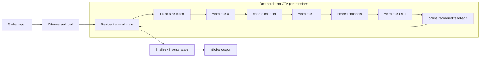

# Hybrid Dataflow NTT

## Purpose

`HybridDataflow` is the experimental backend that implements the architecture's
intended dataflow form. A fixed-size butterfly subgraph is reused inside one CTA
while independent data tokens are streamed through persistent stage roles. The
complete transform state remains on chip from input load to final output store.

This is materially different from `StagePipeline`. That earlier backend launches
one kernel per stage group and time-reuses isolated subcomputations, with the
group boundary materialized in global output. It is retained as a comparison
baseline; it does not claim resident graph streaming.

## Mapping



The four unfolding factors and the physical role refinement have separate
meanings:

| Factor | Current control | GPU resource effect |
|---|---|---|
| stage spatial `U_s` | `stage_space` | persistent warp roles and named-barrier IDs |
| role fusion `U_r` | `role_stages` | consecutive stages per register-resident role |
| batch residency `R_b` | `target_ctas_per_sm` | launch-bounds register target; generated physical-unit ablation |
| stage temporal `T_s` | `ceil(logN / U_s)` within `flow_tile_log_n` rounds | feedback rounds through resident state |
| data spatial `U_d` | `data_space` | active butterfly lanes and shared-bank footprint |
| data temporal `T_d` | `data_time` | independent subgraph tokens packed into one channel handoff |
| token interleave `T_i` | `token_interleave` | independent register states alternated stage-by-stage inside one warp |

`flow_tile_log_n` selects the reusable graph shape, not a global-memory
partition. A transform may traverse several flow rounds, but those rounds read
and write the same CTA-resident state. There is no intermediate global store and
no child-kernel launch.

The generated V100 default balances stage chunks: `logN=10` uses `5+5`,
`logN=12` uses `6+6`, and `logN=13` uses `7+6`. A tail fold activates only its
actual number of warp roles. This avoids routing a small tail through unused
roles and makes decomposition length an explicit architecture parameter rather
than a fixed implementation constant.

## Token And Feedback Semantics

A fold contains at most `U_s` consecutive radix-2 stages. Its token contains
`2^active_stages` coefficients from one independent butterfly subgraph. Each
persistent role applies up to `U_r` consecutive stages while the token remains
in lane-owned registers. Stages below warp width exchange values with
`shfl_xor`; wider stages exchange register slots owned by the same lane.
Bounded shared-memory channels carry the token only between roles, so a full
fold has `ceil(U_s/U_r)-1` materialized edges rather than `U_s-1`.

Fusion does not discard the released stage warps. Each role is replicated
`U_r` times over independent tokens in the same `T_d` packet. This converts
stage-space parallelism into data-space parallelism: the graph becomes
shallower while the CTA retains approximately the original warp budget. A
point with `T_d < U_r` underfills those replicas and is expected to lose.

`T_i` is deliberately separate from `T_d`. A larger `T_d` amortizes packet
loop, synchronization, and boundary bookkeeping. `T_i=2` additionally keeps
two token states live and emits each fused stage for token A and then token B.
The latter can hide dependent modular arithmetic, but it also lengthens register
live ranges; it is therefore a generated physical-unit choice, not an assumed
property of temporal unfolding.

## Physical Units

The backend now separates the graph schedule from the butterfly implementation:

| Unit | Role | Synchronization | State placement |
|:--|:--|:--|:--|
| radix-2 role pipeline | architectural ablation and fine `Ur/Td/Ti` study | at generated role/channel boundaries | registers within a role, shared channels between roles |
| resident radix-4 | primary V100 unit | one CTA barrier per two stages | complete transform in shared memory, four values per logical unit |

The resident radix-4 unit consumes the same bit-reversed input and produces the
same natural-order NTT as the role pipeline. It changes neither the transform
formula nor the one-CTA dataflow contract. It only replaces the physical
realization of two consecutive radix-2 stages, reducing channel traffic,
address/control work, and synchronization frequency. Explicit radix-2 remains
available so the scheduling and physical-unit contributions can be measured
separately.

## Generated V100 Defaults

Automatic `Ur/Td` defaults live in `config/v100_hybrid_dataflow.json`, not in
hand-written dispatch conditionals:

| numeric/shape region | generated default |
|---|---|
| uint32/uint64 `logN=10`, all batch | radix-4, `Ur=5,Td=10,Ti=1,Rb=1` |
| uint32 `logN=12`, `batch <= 2 * SM_count` | radix-4, `Ur=6,Td=12,Ti=1,Rb=1` |
| uint32 `logN=12`, `batch > 2 * SM_count` | radix-4, `Ur=6,Td=6,Ti=1,Rb=1` |
| uint64 `logN=12`, all batch | radix-4, `Ur=6,Td=12,Ti=1,Rb=1` |
| other generated points | resource fallback `Ur=1`, then first legal generated `Td` |

The deeper packet removes the earlier uint64 `logN=12` batch threshold. Explicit
`role_stages`, `data_time`, `token_interleave`, or `target_ctas_per_sm` values
are never overwritten.

Fine `Td=1..16` scans reveal that packet depth follows the physical replica
count rather than a power-of-two rule. With `R=Ur` replicas, a packet takes
`ceil(Td/R)` serial token slots per warp; depths `kR+1` create an imbalanced
tail and the measured sawtooth. The complete model and 1,452 checked timing
runs are documented in
[`results/hybrid_dataflow_td_fine/analysis.md`](../results/hybrid_dataflow_td_fine/analysis.md).

A held-out batch evaluation also tests whether these features can replace the
measured table. Ridge, histogram-gradient, and random-forest rankers combine
packet/slot features with cubin registers, derived resident CTAs, discrete CTA
density, and wave state. The best learned model reaches 1.0188 geometric regret
but 1.151 worst regret. The guarded static policy reaches 1.0052 geometric,
1.0357 p95, and 1.0694 worst regret with 0.986 top-2 recall. Consequently the
model is used only to reduce an unknown target to two candidates; V100 runtime
selection remains measurement-backed. See
[`results/hybrid_dataflow_td_model/analysis.md`](../results/hybrid_dataflow_td_model/analysis.md).
`Plan::selection()` and `cuntt_bench` report whether the mapping came from the
measured static table or the resource fallback, so an uncalibrated shape is
visible without library-side stderr logging.

After the last role, the token is written directly to its logical positions in
resident state. The `hermes-xor` layout performs online physical reordering:

```text
bank = (logical XOR (logical >> flow_tile_log_n)) & (2 * U_d - 1)
physical = (logical & ~(2 * U_d - 1)) | bank
```

This mapping is a permutation, so it changes placement rather than NTT
arithmetic. `linear` is compiled as an ablation. `inplace` is the primary state
mode because tokens within a fold are disjoint; full shared-memory `ping-pong`
is retained only to measure the cost of conservative double buffering.

## Hard Invariants

- One CUDA kernel launch executes each plan invocation.
- One CTA owns one transform and its complete intermediate state.
- `Plan::workspace_size()` is zero; no global intermediate buffer is accepted.
- Forward and inverse use the same modular formula as the reference NTT. Inverse
  scaling is fused into the final store, so there is no floating-point error or
  numerical calibration step.
- A plan is rejected when its resident state and channels exceed per-block
  shared memory. The backend never silently falls back to global staging.
- Only points emitted from `config/v100_hybrid_dataflow.json` are dispatchable.
  This keeps the compiled code and reported design space identical.

For V100, the strict residency limit makes the practical ceiling approximately
`logN=13` for uint64 and `logN=14` for uint32 in primary in-place mode. The exact
limit also depends on `U_s`, channel depth, and device opt-in shared memory.

## Use

```bash
./build-11.8/cuntt_bench --backend hybrid-dataflow \
  --logN 12 --batch 16 --word-bits 64 \
  --compute-unit radix4 \
  --flow-tile-log 6 --stage-space 6 --role-stages 6 --data-space 16 \
  --data-time 12 --token-interleave 1 --pipeline-buffers 2 --dataflow-layout hermes-xor \
  --dataflow-state inplace --stage-handoff named-barrier --verify
```

The backend is intentionally explicit and is not an automatic-selector
candidate until correctness, resource, and performance evidence is complete.

## Experiments

Run correctness and the design sweep:

```bash
cmake --build build-11.8 --target cuntt_tests cuntt_bench -j
./scripts/test_hybrid_dataflow_smoke.sh
./build-11.8/cuntt_tests
BIN="$PWD/build-11.8/cuntt_bench" ./scripts/benchmark_hybrid_dataflow.sh
```

The benchmark defaults to a short, progress-reporting `MODE=quick` scan. Use
`MODE=full` only after the smoke test passes. Every point has a configurable
`TIMEOUT` so a synchronization fault is reported instead of appearing as a
silent long run.

Collect NCU counters from any working directory:

```bash
sudo -E "$PWD/scripts/profile_hybrid_dataflow_ncu.sh"
```

The hard acceptance gates are exact reference equality, a single kernel, and
zero global intermediate traffic. Speedup is reported by length, batch, word
width, and mapping point; it is not assumed as a correctness criterion.

## Current V100 Result

All generated semantic paths pass the GPU correctness suite. The controlled
NCU study confirms that decomposition is a first-order parameter: balanced
`6+6` at `logN=12` cuts replay time from 331.2 us to 187.6 us versus `8+4`,
while barrier stall falls from 50.55% to 13.26%. Compile-time token packing
then reduces the balanced point to 150.3 us at `T_d=4`, removes 25.1% of warp
instructions and 27.6% of integer thread instructions. Active warps remain at
9.37%, while barrier stall rises from 13.26% to 25.55%; packing amortizes
control work but exposes synchronization as the next bottleneck.

Over-decomposition is much more damaging than the barrier counter alone
suggests. `U_s=2` is 28.75x slower than balanced `U_s=6`, executes 10.64x as
many warp instructions and 8.68x as many integer thread instructions, and
reaches only 3.12% active warps. At `logN=13`, `U_s=7,T_d=2` already consumes
90160 B of shared memory; `T_d=4` would require 114736 B and exceeds the V100
98304 B per-CTA limit. The complete counter table and interpretation are in
[`results/ncu_hybrid_dataflow_td/analysis.md`](../results/ncu_hybrid_dataflow_td/analysis.md).

The first register-resident role screen adds a second, batch-dependent
boundary. Full subgraph fusion (`U_r=5`) improves `logN=10` by 1.36x--1.55x
for uint32 and 1.04x--1.29x for uint64. At uint64 `logN=12`, `U_r=6,T_d=8`
loses at batch 1/16 but is 1.46x faster at batch 256. The same mapping does
not win for uint32 `logN=12`. These results require joint selection over word
width, length, batch, `U_r`, and `T_d`; see
[`results/hybrid_dataflow_roles/analysis.md`](../results/hybrid_dataflow_roles/analysis.md).

The pre-launch-bounds NCU capture confirms the mechanism. At `logN=10`, full fusion removes 29.2% of warp
instructions, 25.1% of integer instructions, and 92.7% of shared-load bank
conflicts. At `logN=12,T_d=8`, it removes 30.3%, 24.6%, and 89.7%, respectively.
That capture moves the cost to 142 registers per thread and a 15.63%
long-scoreboard stall. The current generated `R_b=1` launch bound lowers the
cubin footprint to 103 registers with no local allocation; together with the
32768 B shared footprint, this admits three CTAs per SM. Forcing `R_b=3` lowers
the count to 89 but does not add residency and is slower, so it remains an
ablation. Full attribution is in
[`results/ncu_hybrid_dataflow_roles/analysis.md`](../results/ncu_hybrid_dataflow_roles/analysis.md).

The follow-up packet-depth control changes the earlier crossover conclusion.
At matched `T_d=10/12`, explicit `T_i=2` is usually 3%--8% slower than
`T_i=1`; its longer register live ranges do not repay the intended dependency
hiding on V100. Deeper `T_d` itself is valuable: `T_d=10/12,T_i=1` amortizes
packet boundaries and makes full fusion faster than `U_r=1` for every screened
uint64 `logN=10/12` batch. uint32 `logN=12` remains non-monotonic. Results and
the NCU command are in
[`results/hybrid_dataflow_interleave/analysis.md`](../results/hybrid_dataflow_interleave/analysis.md).

The refreshed physical-unit experiment closes the earlier aggregate gap. Across
18 matched uint32/uint64 `logN=10/12` batch shapes, resident radix-4 is 3.769x
faster than the original v0.7 role pipeline and 1.035x faster than the mature
v0.6 path geometrically. In the formal four-version matrix, v0.7 search improves
its own base by 4.760x and reaches 1.028x of v0.6 search overall.

The aggregate hides a clear residency boundary. uint64 `logN=10` reaches
2.127x of v0.6 search and wins all six batches. At `logN=12`, uint32 and uint64
reach 0.785x and 0.651x respectively; v0.7 wins two uint32 batches and is at
parity on one uint64 batch. Thus the missing local unit, rather than the
space-time abstraction, caused most of the original gap. The remaining deficit
is concentrated where a larger per-transform resident state limits each
transform to one CTA while Hybrid2D exposes intra-transform multi-CTA
parallelism. See
[`v06_v07_comprehensive_comparison.md`](v06_v07_comprehensive_comparison.md)
and
[`results/v100_hybrid_radix4_comparison.md`](../results/v100_hybrid_radix4_comparison.md).

That capacity boundary is now addressed by the separate
[Hierarchical Dataflow NTT](hierarchical_dataflow_ntt.md) backend. It keeps each
fixed-size subgraph CTA-resident, writes one online-transposed boundary between
two graph layers, and schedules both layers across persistent CTAs in one
cooperative kernel launch. Strict HybridDataflow remains the zero-workspace,
one-CTA control point rather than silently changing its residency contract.
