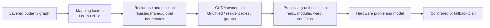

# v0.8 Release Overview

## Release Boundary

v0.8 freezes the current V100 research artifact around **nested physical
space**. Logical stage decomposition, physical execution groups, CUDA work
ownership, residence, pipeline state, layout, and processing-unit selection are
separate fields. The v0.6 GridTiled mapping is retained as a strict candidate,
so a searched v0.8 result cannot silently regress from the mature baseline on a
confirmed semantic cell.

The release is a research baseline, not a claim of universal superiority and
not a cross-GPU portability release. A new GPU must be calibrated before its
mapping table can be promoted to automatic selection.

For a new installation, use [Hardware Profile Initialization](hardware_profile_install.md).
It runs the local capability microbenchmark, writes a device-fingerprinted
profile and a parameterized unfolding model table, and keeps unmeasured
mappings out of automatic selection until they are calibrated.

## Architecture At A Glance



The architecture question is how to organize and reuse the graph. The
processing-unit question is how to implement one local stage group. A stronger
local core can be inserted without changing the mapping abstraction, provided
its lowering contract is satisfied.

## Current V100 Summary

| Workload family | v0.8 status | External comparison boundary |
|:--|:--|:--|
| FFT | Selected direct/online points reach parity or exceed cuFFT; saturated long-batch points remain below it. | cuFFT is the complete external reference for current FFT tables. |
| FWHT | Warp-register and hierarchical candidates are selected by shape. | Dao FHT has only a limited set of strict matching rows. |
| NTT | v0.8 search is effectively at parity with the mature v0.6 envelope in the latest uint32/uint64 confirmation. | GPU-NTT comparisons are sparse and protocol-specific. |
| Structured 2x2 | Confirmed resident points are substantially faster than the v0.6 incumbent in the current V100 closure. | No equivalent external CUDA baseline is installed. |
| Subset/superset/xor zeta | Confirmed resident points are substantially faster than the mature incumbent in the current V100 closure. | No equivalent external CUDA baseline is installed. |

The following long-FFT rows illustrate why the result must be reported by
shape rather than as one global number:

| Shape | v0.6 ms | v0.8 ms | cuFFT ms | v0.8/cuFFT |
|:--|--:|--:|--:|--:|
| FP32 logN18, batch 2 | 0.029778 | 0.029819 | 0.031683 | 1.063x |
| FP32 logN18, batch 16 | 0.201257 | 0.201236 | 0.226406 | 1.125x |
| FP32 logN18, batch 64 | 0.812708 | 0.769270 | 0.707174 | 0.919x |
| FP32 logN20, batch 2 | 0.119460 | 0.119972 | 0.121467 | 1.012x |
| FP32 logN20, batch 8 | 0.416051 | 0.398438 | 0.383160 | 0.962x |
| FP32 logN20, batch 16 | 0.827249 | 0.767611 | 0.724091 | 0.943x |

The complete raw and reduced files are kept under
`results/fft_three_way_v08_current/` and the protocol is described in
[FFT Pipeline Generator](fft_pipeline_generator.md).

## What Is Actually Frozen

- The V100 confirmed-selection overlay is generated from
  `config/v100_v08_confirmed_selection.json`.
- Exact confirmed resident cells report `selection_confidence=confirmed-median`.
- Unmeasured cells remain explicit model/calibrated fallbacks; they are not
  presented as measured optima.
- The cuFFTDx block adapter is bounded to its validated single-role envelope.
  Unsupported multi-role lowering is rejected before kernel launch.
- The runtime and public APIs preserve correctness checks, output-order
  contracts, workspace ownership, and explicit unsupported combinations.

## How To Read The Results

1. Compare only rows with the same operator, precision or modulus, direction,
   normalization, placement, output order, length, batch, and timing boundary.
2. Treat v0.6 as a mature compatibility candidate, not as an external library.
3. Treat cuFFT, Dao FHT, and GPU-NTT as external only when the report labels a
   pinned, matched-protocol row.
4. Do not extrapolate V100 results to A100, H100, RTX, or future GPUs.
5. Use NCU attribution to explain a crossover; a lower launch count alone does
   not prove a resident multi-role graph or a faster steady-state service.

## Reproduction Checklist

```bash
cmake -S . -B build-cuda118-cufftdx2 \
  -DCMAKE_BUILD_TYPE=Release \
  -DCMAKE_CUDA_COMPILER=/usr/local/cuda-11.8/bin/nvcc \
  -DCMAKE_CUDA_ARCHITECTURES=70
cmake --build build-cuda118-cufftdx2 -j2
ctest --test-dir build-cuda118-cufftdx2 --output-on-failure
python3 -m pytest -q
python3 scripts/run_cross_operator_comparison.py --help
```

For privileged NCU collection, use the scripts under `scripts/` and keep raw
files separate from summaries. See [Reproducibility](reproducibility.md) and
[NCU Profiling](ncu_profiling.md) for output ownership and CSV parsing rules.

## Known Limitations And Next Stage

- Cross-GPU calibration and portability are deferred.
- FFT saturation still exposes shared-memory exchange, instruction, and
  boundary-service gaps relative to cuFFT.
- External coverage for Structured and Zeta is absent in the current host.
- Full precision/length/batch coverage is a measurement matrix, not a single
  universal best configuration.

The next stage can extend the numeric and batch regime model without reopening
the v0.8 architecture definition.
