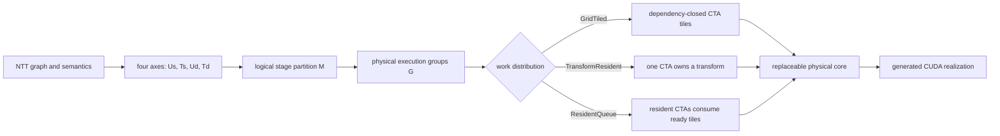

# v0.8 Nested Physical Space

## Motivation

v0.6 and v0.7 crossed because they did not enumerate the same physical
candidate set. v0.6 exposed many ordinary CTAs inside each transform through
Hybrid2D. v0.7 emphasized resident subgraph roles and replaced that ownership
pattern instead of containing it. Comparing their independently searched
minima could therefore select different local cores and different scheduling
quanta. The crossover was a search-space construction defect, not a property
of the NTT graph.

v0.8 makes physical ownership independent from both logical decomposition and
the arithmetic core. Its NTT mapping pipeline is:



The four architecture factors still describe logical spatial and temporal
unfolding. `work_distribution` describes who owns the resulting work on CUDA.
`core` describes how that owner computes one dependency-closed subgraph. These
are orthogonal search dimensions.

## Implemented IR

Every `NttSubgraphMapping` now carries one of:

| Distribution | Ownership | Current realization |
|:--|:--|:--|
| `grid-tiled` | ordinary CTAs own dependency-closed tiles | mature two-pass Hybrid2D radix-4 |
| `transform-resident` | one CTA retains one transform | represented by existing HybridDataflow plans |
| `resident-queue` | producer and consumer CTAs remain resident across the boundary | native transform-ready `10+10` pipeline with an independently selected radix-4 core per role |
| `auto` | backend compatibility default | inferred from the selected backend |

The public plan retains the v0.8 logical mapping. Internally, `grid-tiled`
lowers to the mature Hybrid2D implementation. `resident-queue` remains on the
HierarchicalDataflow backend and launches one cooperative kernel with resident
producer and consumer CTA roles. Producers publish a transform after all
first-layer groups complete; consumers process statically owned second-layer
groups. Each role independently selects `hybrid2d-radix4` or
`dataflow-radix4`, so scheduling and ownership do not force the same local
codelet on both sides of the boundary.

For a 10+10 Cooley-Tukey split, a second-layer local transform consumes values
from every first-layer row group. The dependency-closed publication unit is
therefore a whole transform, while the physical consumer work unit remains
`data_space` local transforms. Dynamic atomic task claiming was measured as a
negative ablation on V100; static task ownership is the current native policy.

Current legality is intentionally strict. Hybrid2D radix-4 requires two
execution groups, local logs in `[6,10]`, `data_space` in `{1,2,4}`,
`data_time=1`, and one full-scratch boundary. A resident role using
Dataflow radix-4 currently requires `data_space=4`. The resident queue is
generated only for `10+10`; unsupported combinations fail plan construction
instead of silently changing semantics.

## Stable Diagnostics

`SelectionInfo` reports:

- `mapping_id`: stable identity over numeric width, length, batch, partition,
  distribution, core, data-space/time, and thread count;
- `ctas_per_transform` and `total_ctas`: logical work granularity;
- `resident_slots`, `grid_waves`, and `tail_fill`: target-device scheduling
  pressure;
- `native_v08`: whether the selected path uses a native v0.8 realization. It
  is true for supported DD GridTiled, ResidentQueue, and CooperativePhased
  `10+10` specializations. It is false after Hybrid2D compatibility lowering,
  including when the logical descriptor itself is `10+10` GridTiled.

The benchmark emits these fields in CSV even for explicit mappings. They make
batch/length crossovers attributable to wave quantization, occupancy, or core
latency rather than a version label.

## Generator And Inclusion Invariant

`generate_ntt_partition_space.py` emits schema v3. It enumerates work
distribution beside stage partition, execution grouping, boundary storage,
and physical core. `config/ntt_v08_physical_core_registry.json` records the
legal capability set. The checked-in configuration stores the 25 logical and
28 execution shortlist entries, while the 3950-point full logical space is
generated on demand with `--include-all`; it is not duplicated in the
repository. The generated document contains this invariant:

```text
every legal v0.6 point has a behaviorally identical v0.8 candidate
```

For `logN=12..20`, the imported candidate is Hybrid2D radix-4 with
`grid-tiled` ownership. The release choice is the lower measured envelope of
that control and the new resident candidates. Consequently, a v0.8 regression
against v0.6 is a selection, generation, or measurement defect, not an
acceptable architectural crossover.

## Reproduction

Run a single imported candidate:

```bash
./build-cuda118-gcc9/cuntt_bench \
  --backend hierarchical-dataflow --logN 20 --batch 16 \
  --word-bits 32 --modulus 998244353 --stage-partition 10,10 \
  --segment-cores hybrid2d-radix4 \
  --segment-work-distribution grid-tiled \
  --segment-data-space 2 --segment-data-time 1 \
  --segment-threads 512 --segment-units 1 \
  --segment-cta-weights 10,10 --boundary-storage full-scratch \
  --verify --csv
```

Run the matched v0.6/v0.7/v0.8 matrix:

```bash
./scripts/benchmark_v08_envelope.sh
```

Run the next-round comprehensive matrix, which adds the radix-2 base,
phase-specialized DD GridTiled, ResidentQueue, and CooperativePhased under one
balanced, interleaved CUDA-event protocol:

```bash
# Short protocol: uint32/uint64, logN 16/20, batch 4/16/64/80.
MODE=quick ./scripts/benchmark_v08_comprehensive.sh

# Publication protocol: logN 12/14/16/18/20 and batch 1/4/16/64/80/160.
MODE=full ./scripts/benchmark_v08_comprehensive.sh

# Resume an interrupted run without duplicating completed process trials.
MODE=full RESUME=1 ./scripts/benchmark_v08_comprehensive.sh
```

The analyzer writes `raw.csv`, `summary.csv`, `metrics.json`, and
`analysis.md` below `results/v08_comprehensive_<mode>/`. The `v0.8 oracle`
column is deliberately named as an oracle: it is the lower measured envelope
of candidates on the same points and is not a held-out selector evaluation.
The report joins archived GPU-NTT only when numeric width, length, batch,
modulus, and output order all match. NCU replay times never enter this table.
The protocol also enforces a minimum accumulated warmup time: quick uses 50 ms
and full uses 250 ms in addition to their minimum warmup counts. A short
calibration run converts that duration to a per-candidate count. This prevents
a 0.03-ms small-batch kernel from receiving only a few milliseconds of clock
warmup while a multi-millisecond large-batch kernel receives several seconds.

The analyzer writes `results/v08_envelope_mixed_core/summary.csv` and
`analysis.md`. It computes ratios from matched trials and fails if the imported
GridTiled candidate is more than 3% slower than its identical v0.6 physical
point. The envelope uses the v0.6 median as the canonical time for this alias,
so a clock transition between two identical launches cannot become a false
v0.8 win. The first short smoke check at uint32 `logN=12`,
batch 1 measured identical `0.011264 ms` event times for the two aliases. That
single value validated lowering identity before the complete matrix was run;
the 384-sample envelope below was the first multi-regime checkpoint, and the
60-point comprehensive matrix is the current release evidence.

The scan is restartable and holds a shared GPU lock with the NCU scripts. If a
run is interrupted, continue it without repeating completed trials:

```bash
RESUME=1 ./scripts/benchmark_v08_envelope.sh
```

The 64-bit sweep uses `1152921504606584833` through `logN=18`. That modulus
has exactly 18 power-of-two factors in `q-1`, so `logN=20` uses the equally
60-bit `576460756061519873`, whose `q-1` supports transforms through
`logN=29`. Modulus is part of both the result grouping key and the resume key.

## V100 NCU Attribution

The following matched uint32, `logN=20`, batch-16 capture predates the native
resident-ready kernel and records the two-phase adapter root cause. It is kept
as historical attribution. Multi-kernel traffic, time, and instruction
counters are summed; percentage metrics are kernel-time weighted.

| implementation | kernels | time (us) | read (MiB) | write (MiB) | load sectors | store sectors | active warps | long scoreboard |
|:--|--:|--:|--:|--:|--:|--:|--:|--:|
| v0.6 | 2 | 1226.560 | 255.98 | 130.87 | 33,945,921 | 16,777,216 | 96.53% | 15.43% |
| v0.7 | 1 | 1132.992 | 258.41 | 142.26 | 29,815,752 | 8,388,611 | 49.31% | 40.60% |
| v0.8 GridTiled | 2 | 1232.128 | 255.98 | 131.04 | 33,944,798 | 16,777,216 | 96.60% | 15.33% |
| pre-native ResidentQueue adapter | 1 | 1548.224 | 331.83 | 298.83 | 33,966,406 | 16,777,216 | 49.52% | 52.29% |

`GridTiled` reproduces v0.6 within profiler noise: time is `1.0045x`, while
load sectors and warp instructions are both effectively `1.0000x`. This is
the required inclusion control. The historical queue adapter is `1.262x` the
v0.6 time and `1.366x` the v0.7 time. Relative to v0.7 it moves `1.284x` DRAM
reads and `2.101x` DRAM writes, despite executing fewer warp instructions.
The deficit is therefore the materialized two-phase boundary and its long
memory-dependency chain, not excess butterfly arithmetic. The native path
added afterward removes the full phase drain and builds the fused coefficient
tree required by the Hybrid2D physical codelet.

## Homogeneous Native Attribution

The first native single-kernel capture used Hybrid2D radix-4 for both roles.
At uint32 `logN=20,batch=16`, it removed the adapter's excess sectors but did
not reproduce the Dataflow consumer's instruction mix:

| implementation | time (us) | load sectors | store sectors | active warps | long scoreboard | registers/thread |
|:--|--:|--:|--:|--:|--:|--:|
| v0.6 | 1233.472 | 33,959,331 | 16,777,216 | 96.55% | 15.69% | 32 |
| v0.7 | 1131.936 | 29,769,246 | 8,388,611 | 49.46% | 42.19% | 40 |
| v0.8 GridTiled | 1229.152 | 33,942,336 | 16,777,216 | 96.61% | 15.55% | 32 |
| resident Hybrid2D/Hybrid2D | 1216.480 | 29,764,987 | 8,388,611 | 48.56% | 45.10% | 32 |

Global sectors are effectively identical to v0.7, while the resident path has
lower IPC (`0.370` versus `0.450`), `1.476x` CBU instructions, and about `3x`
ADU instructions. This isolated the remaining loss in the role-local codelet,
not the global boundary. Replacing the consumer with Dataflow radix-4 recovers
the single-point performance below.

The current mixed Dataflow/Dataflow point is captured separately, without
overwriting either historical data set:

```bash
sudo -E ./scripts/profile_v08_envelope_ncu.sh
```

The new report is written to `results/ncu_v08_mixed_core/`.

Profile the row/thread/core attribution matrix after changing a physical
candidate:

```bash
sudo -E ./scripts/profile_v08_physical_axis_ncu.sh
```

This produces `results/ncu_v08_physical_axis/analysis.md`. It compares v0.6
against DD `ds4/t256`, DD `ds2/t256`, DD `ds2/t512`, and HH `ds2/t512` under
one matched numeric workload. The preflight requires every resident candidate
to report `native_v08=1`, so an unsupported mapping cannot silently enter the
attribution table.

## Mixed-Core Native Attribution

The matched uint32 `logN=20,batch=16` capture uses Dataflow radix-4 for both
resident roles with a `9:11` producer/consumer split:

| implementation | time (us) | load sectors | store sectors | active warps | long scoreboard | IPC |
|:--|--:|--:|--:|--:|--:|--:|
| v0.6 | 1225.152 | 33,950,745 | 16,777,216 | 96.64% | 15.37% | 0.375 |
| v0.7 | 1115.872 | 29,800,632 | 8,388,611 | 49.29% | 40.86% | 0.450 |
| v0.8 GridTiled | 1228.256 | 33,949,986 | 16,777,215 | 96.54% | 15.53% | 0.370 |
| resident Dataflow/Dataflow | 1076.704 | 29,850,141 | 8,388,611 | 48.60% | 39.85% | 0.440 |

The native resident point is `0.879x` the v0.6 time and `0.965x` the v0.7
time. Relative to the older Hybrid2D/Hybrid2D resident core, global load/store
sectors are unchanged, while ADU instructions fall by about 42%, long
scoreboard stalls fall by 11.6%, and IPC rises by 18.9%. This establishes that
the gain comes from the role-local physical core and its dependency chain, not
from another boundary-traffic change. The full generated report is
`results/ncu_v08_mixed_core/analysis.md`.

## Initial Native V100 Envelope

The mixed-core sweep contains 384 samples and 40 matched
numeric/length/batch points. Paired GridTiled compatibility has median
`1.0000x` and maximum `1.00254x` versus v0.6. This initial candidate envelope
selected the Dataflow/Dataflow resident core at uint32
`logN=20,batch=16` and GridTiled at the other 39 points. The later
comprehensive matrix includes DD GridTiled and supersedes this selection.

| bits | batch | v0.6 ms | v0.7 ms | resident-ready ms | resident/v0.6 | resident/v0.7 |
|---:|---:|---:|---:|---:|---:|---:|
| 32 | 1 | 0.100311 | 0.129987 | 0.150180 | 1.511x | 1.034x |
| 32 | 16 | 1.052017 | 1.057331 | 1.015900 | 0.966x | 0.962x |
| 32 | 80 | 5.176126 | 8.132209 | 6.070559 | 1.175x | 0.747x |
| 32 | 160 | 10.313350 | 17.968159 | 12.510863 | 1.213x | 0.697x |
| 64 | 1 | 0.148029 | 0.254126 | 0.228690 | 1.545x | 0.900x |
| 64 | 16 | 1.610220 | 1.934397 | 1.837660 | 1.141x | 0.949x |
| 64 | 80 | 7.914117 | 9.309891 | 9.204736 | 1.164x | 0.989x |
| 64 | 160 | 15.863695 | 19.064739 | 18.917725 | 1.193x | 0.999x |

The regime-seeded resident core wins 7/8 points against v0.7 and 1/8 against
v0.6. At its selected point it is 1.035x faster than v0.6 and 1.039x faster
than v0.7. The Dataflow consumer improves the resident path by 14-20% at large
uint32 batches as well, but fixed producer/consumer CTA reservation still
sacrifices the full-grid parallelism of the two-pass implementation. It remains
an experimental search candidate outside the selected point.

Pipeline `%globaltimer` traces show that the large-batch deficit is not a
failure to overlap the two roles. At batch 80 and 160, the producer and
consumer active intervals overlap for about 5.95 ms and 12.34 ms respectively;
startup and drain tails are each below 0.10 ms. The steady-state overlap is
therefore above 97%. The remaining gap is physical throughput while both roles
share an SM: the matched NCU point reports 48.6% active warps versus 96.6% for
the two-pass v0.6 control, together with a much larger long-scoreboard share.
This directs the next search toward CTA row/thread granularity and resource
pressure rather than adding more queue or graph machinery.

The 64-bit refinement is also a mapping result: copying the uint32 `6:14`
service split produced 12.7/25.7 ms at batch 80/160. Jointly searching the
physical core and role service rate selected Dataflow/Dataflow with `9:11` at
batch 16/80 and `10:10` at batch 160, reducing those points to
1.838/9.205/18.918 ms. Thus numeric width changes the preferred scheduling
point even though the logical `10+10` graph is unchanged.

## Comprehensive Matrix: First Focused Round

The first balanced, interleaved three-trial run of the comprehensive protocol holds
uint32, `logN=20`, natural order, and modulus `998244353` constant. It compares
the radix-2 base, v0.6, v0.7, the v0.8 compatibility alias, and all three
current native work distributions. CUDA-event medians are:

| batch | radix-2 base (ms) | v0.6 (ms) | v0.7 (ms) | DD Grid (ms) | ResidentQueue (ms) | CooperativePhased (ms) | DD Grid / v0.6 speedup |
|---:|---:|---:|---:|---:|---:|---:|---:|
| 16 | 1.247160 | 1.052047 | 1.056297 | 0.855736 | 1.019392 | 0.917791 | 1.229x |
| 80 | 6.107914 | 5.170360 | 8.135752 | 4.128174 | 6.064968 | 8.386693 | 1.252x |

Both points are stable under the protocol. Their DD Grid geometric mean is
`1.468x` the radix-2 base, `1.241x` v0.6, and `1.560x` v0.7. GridTiled
compatibility is within `0.04%/0.18%` of v0.6, so the result is not caused by
a version-label or lowering difference.

This round separates two claims. The nested physical design space already
finds a substantially better physical core and phase-specialized grid mapping.
The resident scheduling mechanisms do not yet realize that core's full-grid
throughput: ResidentQueue is `1.19x/1.47x` slower than DD Grid at batch 16/80,
and CooperativePhased is `1.07x/2.03x` slower. Therefore the current release
envelope should select DD Grid for these points while preserving the resident
implementations as research candidates. The generated report is
`results/v08_comprehensive_focus/analysis.md`.

Two exact-contract uint64 `logN=16` confirmations use the same 60-bit modulus
and natural output order as the archived GPU-NTT run. Adaptive 250-ms warmup
and five process trials give `0.029409 ms` versus GPU-NTT's `0.032881 ms` at
batch 4 (`1.118x`) and `0.275180 ms` versus `0.386632 ms` at batch 64
(`1.405x`). The measured batch-4 kernel is above the conservative 0.020-ms
timing floor and passes the three-percent stability filter. Because the
GPU-NTT rows are archived rather than interleaved, these ratios establish the
current performance region but not a sub-percent comparison.

The combined round-1 report contains four stable points. Its v0.8 oracle is
`1.261x` the radix-2 base, `1.114x` v0.6, and `2.004x` v0.7 by geometric mean.
The two exact GPU-NTT matches have a `1.253x` geometric mean. The oracle selects
DD Grid for both uint32 `logN=20` points and the v0.6-compatible path for both
uint64 `logN=16` points. This is direct evidence for a regime selector rather
than a single universal resident default. See
`results/v08_comprehensive_round1/analysis.md`.

## Complete Width/Length/Batch Matrix

The publication protocol completes 60 semantic points: uint32 and uint64,
`logN=12/14/16/18/20`, and batch `1/4/16/64/80/160`. Each candidate receives
five balanced process trials after adaptive warmup. All 1,380 raw executions
pass the correctness preflight; 57/60 oracle points pass the absolute-time
stability filter.

| scope | v0.8 oracle vs radix-2 base | vs v0.6 | vs fixed v0.7 resident | selected family |
|:--|--:|--:|--:|:--|
| 57 stable points | 1.138x | 1.017x | 2.705x | v0.6 compat: 51, DD Grid: 6 |
| uint32, logN=20 (all six batches) | 1.372x | 1.169x | 1.589x | DD Grid: 6 |

The boundary is exact over all 60 measured points, including the three points
flagged for absolute-time drift: DD GridTiled wins every uint32 `logN=20`
batch, while the v0.6-compatible GridTiled mapping wins every other
width/length regime. The resulting two-branch static policy has 60/60 oracle
agreement and `1.000000x` stable geometric-mean regret. This is materially
simpler than a batch threshold and is now generated into the runtime selector.

At uint32 `logN=20`, DD GridTiled improves on v0.6 by
`1.093x/1.159x/1.230x/1.154x/1.192x/1.191x` at batches
`1/4/16/64/80/160`. The corresponding uint64 DD candidate is slower than
v0.6 at every batch, showing that numeric width changes the preferred physical
core even when the logical `10+10` graph and work distribution are unchanged.

Three uint64 points (`logN=18,batch=64/80` and `logN=20,batch=16`) fail the
absolute-time filter because the fast Hybrid2D launches drift across process
trials. They do not change family selection. The paired v0.8 compatibility
alias, which lowers to the identical kernels, remains close to v0.6 and is the
control for distinguishing clock/thermal drift from a mapping effect.

The `v0.7` column in this protocol is one fixed resident `10+10` Dataflow
mapping, not a searched release-wide v0.7 envelope. It isolates the cost of
that physical realization and must not be cited as a comparison with every
v0.7 design point. Two exact-contract archived GPU-NTT rows match at uint64
`logN=16`, batch 4/64; the selected implementation is `1.119x/1.386x` faster
(`1.245x` geometric mean). Because those external measurements are archived
rather than interleaved, they establish the performance region rather than a
sub-percent claim. Full rows and machine-readable metrics are in
`results/v08_comprehensive_full/analysis.md` and `metrics.json`.

Validate the deployed boundary on batches and moduli excluded from its input
table with:

```bash
MODE=quick ./scripts/benchmark_v08_selector_holdout.sh
MODE=full ./scripts/benchmark_v08_selector_holdout.sh
```

This protocol interleaves the explicit v0.6 and DD Grid candidates with the
actual `--auto-select` path. Its report distinguishes policy/oracle agreement,
runtime implementation identity, and auto/explicit timing equivalence; a
policy reversal remains visible rather than being normalized away.

The completed quick run adds batch 2/32 and one holdout modulus per width
(`1004535809` for uint32 and `1152921504577486849` for uint64). The deployed
policy matches the explicit two-candidate oracle at 8/8 points, and the runtime
reports the intended implementation/native identity at 8/8 points. Five points
pass the strict three-trial range filter; over them the selected family is
`1.177x` faster than its competitor and auto/explicit time is `0.999x` by
geometric mean. Three points are marked unstable because their full
three-trial range exceeds 3%, but none changes the winning family. See
`results/v08_selector_holdout_quick/analysis.md`.

## Work-Distribution Isolation

The physical-axis implementation exposed and fixed a dispatch defect: DD
`data_space=1/2` mappings were reported as native while falling through to the
generic hierarchical kernel. `native_v08` now calls the same exact detector
as dispatch. NCU captures made before this fix are not valid evidence for the
DD `ds1/ds2` resource counts and must be recollected.

The decisive control holds the DD radix-4 codelet, `data_space=4`, 256-thread
CTA, `10+10` partition, and full-scratch layout constant. Only work ownership
changes:

| batch | v0.6 HH Grid (ms) | DD GridTiled (ms) | DD ResidentQueue (ms) | DD CooperativePhased (ms) |
|--:|--:|--:|--:|--:|
| 16 | 1.157 | 0.910 | 1.119 | 1.028 |
| 80 | 5.157 | 4.125 | 7.815 | 8.372 |
| 160 | 10.309 | 8.213 | 17.842 | 21.943 |

The ordinary two-launch DD realization is about `1.27x`, `1.25x`, and
`1.26x` faster than the mature v0.6 HH codelet at these paired points. This proves
that the DD physical core is not the large-batch bottleneck. Relative to DD
GridTiled, ResidentQueue grows from `1.23x` to `2.17x` time and
CooperativePhased from `1.13x` to `2.67x` as batch grows.

The Grid measurements exclude an initial DVFS transition and remove
performance-path trace atomics; fixed-clock NCU remains the publication
authority. The cubin resource control is consistent but not sufficient by itself:
uint32 DD/ds4 GridTiled uses 32 registers/thread in the producer and 38 in the
consumer, CooperativePhased uses 40, and ResidentQueue uses 40 plus a 16-byte
local stack. The persistent kernels also retain both phase bodies and execute
many row groups serially in each CTA. GPU GridTiled instead gives every
dependency-closed group a fresh CTA and lets the V100 warp/CTA scheduler form
the wave pipeline.

Using `data_time` as a contiguous per-CTA row-group chunk is an explicit
negative ablation. At batch 80, chunk lengths `1/2/4/8` take
`8.36/11.12/13.31/14.44 ms`. Serial reuse loses simultaneous spatial coverage;
therefore data-time expansion cannot be modeled as an unconditional chunk
increase. The search objective must jointly account for codelet service time,
resident CTA count, spatial coverage, and phase specialization.

## Resident Vector-Core Candidate

The physical-core sweep exposed a dispatch mismatch in the homogeneous
vector-radix4 candidate: a mapping declared as `128 threads / 4 units` was
previously instantiated through the `256 threads / 2 groups` template branch.
The logical result was still correct, but the reported physical point was not
the requested point. The dispatch now selects `128/1` for the one-group form
and `256/2` for the two-group form; both use the same register/vector
radix-4 codelet and retain the resident producer/consumer schedule.

The candidate is exposed as
`v08-resident-ready-homogeneous-warp128-vector-radix4` and reports
`native_v08=1` only for the exact supported contract: uint32, `10+10`,
resident queue, `data_space=4`, `data_time=1`, full-scratch boundary, and
either `(threads, units)=(128,4)` or `(256,8)`. It is an explicit design-space
option; the calibrated selector continues to choose DD GridTiled or the v0.6
GridTiled compatibility point because the resident control protocol remains
the limiting factor at large batches.

On the V100 at logN=20, batch=16, the corrected 128-thread point completes in
about 1.45 ms after warm-up, while the 256-thread/two-group point is also about
1.44 ms under the same runtime conditions. This confirms that the prior
resident-vector measurement was not evidence of a distinct 128-thread speedup;
the useful result is the physical identity correction and a valid candidate for
future resident scheduling work.

## Producer-leading startup window

Resident kernels now expose `PlanConfig::producer_ahead` and the CLI option
`--producer-ahead K` as a controlled scheduling experiment. For the two-level
`ResidentQueue`, `K>0` holds consumers until `K` complete transforms have
published their first-pass boundary packets. For the specialized three-level
fine-wave kernel, the same field counts first-layer publication waves, so the
consumer starts after the smallest useful dependency-closed unit is ready.
`K=0` preserves the historical eager-consumer behavior and the parameter is
included in `mapping_id` as `-paK`.

This is deliberately a startup gate, not a replacement for APPT online
consumption. The three-level path already uses `ready0/ready1` counters for
per-wave consumption; the gate only controls when its consumer role first
enters that protocol. Under the current 10+10 boundary layout, a second-pass
tile still depends on every first-pass row group of its transform, so only the
three-level path can expose an intra-transform wave. The option measures
producer/consumer phase separation without adding a kernel launch and is not
enabled by automatic selection.

An exploratory same-session sweep on the V100 (uint32, logN=20, radix-4,
`data_space=4`, 256 threads/CTA) measured the following CUDA-event medians:

| batch | `pa=0` | `pa=1` | `pa=2` | `pa=4` | `pa=8` |
|---:|---:|---:|---:|---:|---:|
| 16 | 1.048 ms | 1.075 ms | 1.136 ms | 1.211 ms | 1.326 ms |
| 80 | 8.143 ms | 8.196 ms | -- | 8.579 ms | -- |

For the specialized three-level `7+7+6` point at batch 1, the same-session
screen was `0.572/0.576/0.593 ms` for wave leads `K=0/1/4` (uint32,
`u8`, `target_ctas_per_sm=2`). All three runs verified correctly. The small
increase is expected: the gate changes startup order only; it does not add
more producer service capacity or remove the fixed role partition.

The values are a scheduling screen rather than a fixed-clock publication
capture. They show the expected trend: delaying a resident consumer does not
recover throughput and becomes increasingly costly as the window grows. The
result supports moving the next implementation step to per-closure readiness
and online reorder, where consumer CTAs can do useful work before a whole
transform is complete without reserving a spinning CTA.

To scan the producer/middle/consumer CTA service allocation independently of
the stage partition, run:

```bash
BATCHES="1 4 16 64" ./scripts/benchmark_three_level_role_weights.sh
```

Set `WORD_BITS=64` to repeat the same screen with the 64-bit modulus; the
script selects `576460756061519873` unless `MODULUS` is supplied explicitly.

The script fixes `7+7+6`, the generated radix-4 physical core, and two target
CTAs per SM. It stops before writing a record when the CUDA driver is absent;
the output is summarized in `summary.csv` and `analysis.md`.

To separate partition-order effects from role-service effects, use the
parameterized three-level partition screen:

```bash
WORD_BITS=64 BATCHES="4 16 64" TRIALS=3 \
  PARTITIONS="6,7,7 7,6,7 7,7,6 6,6,8 6,8,6 8,6,6" \
  ./scripts/benchmark_three_level_partitions.sh
```

`WORD_BITS` selects the matching default modulus (override with `MODULUS`),
and `PARTITIONS` controls the candidate order without changing the physical
core, CTA count, or stage-proportional weights. This screen should be run
before promoting a role policy: a width-specific weight winner on one
partition is not evidence that the same weights transfer to another partition.
The three-level launcher opts into V100's larger dynamic-shared-memory budget
for 64-bit points whose local stage is 8, so the default 32-row physical core
remains comparable across all six partitions.

The completed V100 screen (`results/three_level_role_weights/`) found
`6:6:8` best at batch 1/4 (`0.560/2.288 ms`), but `4:4:12` best at batch
16/64 (`10.361/51.676 ms`). A three-trial confirmation for the crossover
points (`results/three_level_role_weights_confirm/`) reports
`2.282/10.380/51.604 ms` for the winners at batch 4/16/64; the default
`6:6:8` is 1.094x and 1.091x slower at batch 16/64. The crossover is stable
enough to justify batch-conditioned weight search, but the selector remains
unchanged until the same policy is checked across numeric widths and nearby
physical points.

That numeric-width check is now complete for the 64-bit path. The matched
three-trial screen (`results/three_level_role_weights_u64_confirm/`) selects
`4:4:12` at batch 4/16/64 (`3.054/13.747/68.606 ms`); `6:6:8` is
1.048x/1.207x/1.058x slower at those batches. Thus role service is a
hardware-and-arithmetic mapping key: batch size alone is insufficient, and the
32-bit small-batch `6:6:8` point must not be reused for 64-bit plans. These
measurements are a policy calibration result, not evidence that one role split
is universally optimal; the automatic selector remains conservative until
nearby partitions and physical cores have the same width-specific coverage.

The first matched partition screen is complete for uint64
(`results/three_level_partitions_u64/`). With stage-proportional weights and
the same 32-row radix-4 core, `8+6+6` wins at every tested batch:
`0.805/2.207/8.129/32.899 ms` for batch 1/4/16/64. The next point,
`6+6+8`, is 1.169x/1.048x/1.082x/1.049x slower. This is a stronger effect
than the role-weight crossover on fixed `7+7+6`, so the mapping search order
must select the stage partition before calibrating producer/middle/consumer
service weights. The screen still fixes the physical core and uses
stage-proportional weights; it is evidence for search ordering, not yet a
runtime policy.

The follow-up role screen for the uint64 winner `8+6+6`
(`results/three_level_role_weights_u64_p866/`) confirms that partition and
service allocation interact. The best weights are `8:6:6` at batch 1 and 64,
but `10:5:5` at batch 4 and 16. At batch 64, `8:6:6` reaches 32.029 ms,
while the nearest `8:8:4` point is 3.4% slower; at batch 16, `10:5:5`
reaches 7.709 ms, 4.2% ahead of `8:8:4`. The static mapping key therefore
needs both `stage_partition` and role weights, with batch and numeric width as
additional dimensions. These results are still a calibration screen because
only nine weight candidates were tested and nearby physical-core choices remain
unmeasured.

Collect matched dynamic counters at the large-batch point with:

```bash
sudo -E ./scripts/profile_v08_distribution_axis_ncu.sh
```

The default is batch 80. Override it with `BATCH=16` or `BATCH=160`. The
generated report compares v0.6, DD GridTiled, DD ResidentQueue, and DD
CooperativePhased and rejects any non-native v0.8 preflight.

The completed batch-80 fixed-clock capture reports 6030.208 us for v0.6,
4423.712 us for DD GridTiled, 5801.120 us for ResidentQueue, and 5048.384 us
for CooperativePhased. CooperativePhased has 0.998x Grid load sectors, equal
store sectors, and 1.007x warp instructions, but only 49.69% active warps and
0.895x Grid IPC. Its loss is therefore not extra NTT arithmetic or external
traffic. It is the inability of a persistent CTA that serially traverses
complete row groups to expose the same ready-warp population as ordinary
GridTiled CTAs. ResidentQueue additionally executes 17.73x ADU and 1.91x CBU
warp instructions because of readiness and address/control work.

### Dual 128-thread physical subgraphs

`units_per_cta=2` now has a native CooperativePhased realization. One
256-thread CTA contains two independent 128-thread subgraphs, two shared-state
regions, and two SM70 named-barrier domains. `data_space={1,2,4}` remains an
independent per-subgraph row count. Both subgraphs stream their own row-group
sequence, meet at the existing grid barrier between the two `10`-stage folds,
and then resume independently. Forward, inverse, and all three row
granularities pass exact checks.

A same-session batch-80 event control gives:

| mapping | target CTA/SM | kernel ms | relative to Grid |
|:--|--:|--:|--:|
| DD GridTiled, `u1 ds4` | 4 | 4.129 | 1.000x |
| v0.6 Hybrid2D | n/a | 5.603 | 1.357x |
| CooperativePhased, `u1 ds4` | 1 | 9.525 | 2.307x |
| CooperativePhased, `u1 ds4` | 2 | 6.143 | 1.488x |
| dual tile, `u2 ds4` | 1 | 6.499 | 1.574x |
| dual tile, `u2 ds2` | 1 | 8.873 | 2.149x |

At equal CTA residency, dual `u2 ds4` is 1.466x faster than `u1 ds4`, so
inter-subgraph hardware interleaving is real and useful. It is nevertheless
5.8% slower than two resident full-width CTAs and 57.4% slower than GridTiled.
`u2 ds2` also loses despite matching the original total rows per CTA. The
current dual kernel halves the threads assigned to a shared-memory radix-4
codelet that was designed for 256 threads; four rows are required to amortize
its coefficient and barrier work. The remaining task is consequently a true
128-thread register/vector candidate is now available and dispatched
faithfully; its remaining gap is in resident role scheduling rather than in
the logical butterfly or data layout.

SM70 occupancy reporting admits the `u2 ds1,target=8` cooperative grid even
though the two named-barrier domains fail to make timely forward progress at
that residency. The plan therefore rejects this diagnostic mapping above four
CTAs/SM instead of silently changing the requested experiment. Collect the
targeted causal counters with:

```bash
sudo -E ./scripts/profile_v08_dual_tile_ncu.sh
```

The report compares Grid, one and two full-width phased CTAs, and dual tiles
with two and four rows per 128-thread subgraph.

## Remaining Work

- validate the generated two-branch selector on held-out batches and moduli,
  while explicitly reporting extrapolation outside the measured table;
- improve the uint64 DD physical core, where the current modular arithmetic
  and resource footprint erase the ownership gain seen in uint32;
- preserve phase-specialized GridTiled kernels as a first-class v0.8 mapping
  and evaluate CUDA Graph replay separately from kernel event time;
- replace fixed role reservation only when a wave-adaptive mapping beats the
  DD GridTiled physical control at the same numeric point;
- generate resident-ready cores for partitions other than `10+10`, where a
  smaller dependency-closed publication unit may exist;
- retain dynamic task claiming as an explicit negative ablation until a
  contention-free hardware mapping is demonstrated;
- extend the same ownership IR to FFT, FWHT, zeta, and Structured 2x2 after the
  NTT contract is stable;
- calibrate another GPU only after the V100 candidate and diagnostics contract
  is frozen.
