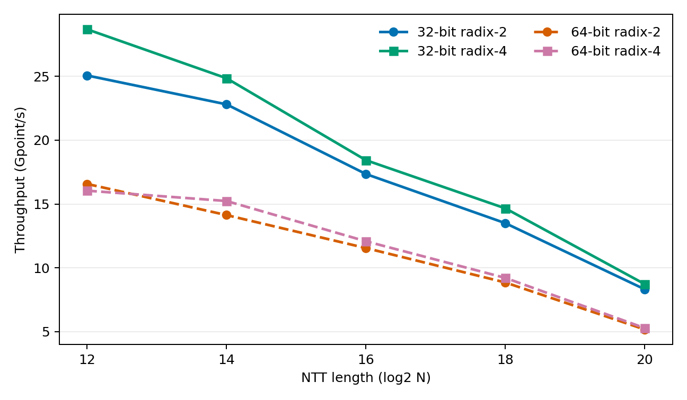
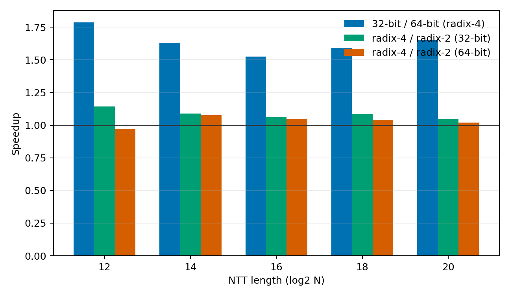

# V100 Hybrid2D Parameter Matrix

## Method

The matrix isolates three architecture and implementation axes:

- transform length: `logN={12,14,16,18,20}`;
- arithmetic precision: a 32-bit Shoup path for 30-bit moduli and a 64-bit
  Shoup path for 30-, 40-, 50-, and 60-bit moduli;
- equivalent local processing unit: one-stage radix-2 or two-stage fused
  radix-4, with the same Hybrid2D global schedule.

Every modulus is a real prime with `q = 1 mod N`. Each configuration processes
approximately `2^22` points per invocation, using a length-dependent batch.
CUDA events measure the two Hybrid2D kernels only. The reported value is the
median of three independently launched processes in randomized order, with 50
warmups and 200 timed repetitions per process. Raw and aggregated data are in
`results/hybrid2d_matrix_raw.csv` and `results/hybrid2d_matrix.csv`.
This matrix uses the original `--cross-twiddle first` organization and predates
coset-twiddle fusion; it remains the arithmetic-width and processing-unit
baseline rather than the current best-performance table.

Reproduce the matrix and figures with:

```bash
scripts/sweep_matrix.py --warmup 50 --repeat 200 --trials 3
python3 scripts/plot_matrix.py
```

## Precision And Processing Unit

The following table uses the same 30-bit modulus in both physical word paths.

| logN | 32-bit radix-2 NTT/s | 32-bit radix-4 NTT/s | 64-bit radix-2 NTT/s | 64-bit radix-4 NTT/s | 32/64 speedup, radix-4 |
|-----:|----------------------:|----------------------:|----------------------:|----------------------:|------------------------:|
| 12 | 6,120,513 | 7,003,782 | 4,045,553 | 3,916,807 | 1.79x |
| 14 | 1,392,021 | 1,516,898 | 862,470 | 929,748 | 1.63x |
| 16 | 264,696 | 281,240 | 176,168 | 184,292 | 1.53x |
| 18 | 51,483 | 55,910 | 33,760 | 35,124 | 1.59x |
| 20 | 7,928 | 8,314 | 4,927 | 5,031 | 1.65x |

The true 32-bit path is 1.50--1.65x faster than the 64-bit path for radix-2 and
1.53--1.79x faster for radix-4. It uses 32-bit coefficients and twiddles,
`__umulhi` Shoup reduction, and half-width shared/global data.

Radix-4 reduces block barriers by fusing pairs of dependent stages. It improves
the 32-bit path by 4.9--14.4% and improves the 64-bit path by 2.1--7.8% for
`logN=14..20`. For the short 64-bit `logN=12` case it is 3.2% slower. The
preferred equivalent unit is therefore length- and word-width-dependent rather
than an architecture constant.

## Modulus Width

Holding the physical path at 64 bits, changing the real modulus width from 30
to 60 bits changes median throughput by at most 1.5% for every tested length and
unit. This is expected: all cases execute the same 64-bit multiply-high, low
multiply, and correction sequence. Modulus bit count alone is not a useful
performance classification; physical word width and reduction method are.

## Architecture Implication

The two-pass Hybrid2D schedule remains unchanged across all 50 configurations.
Only the local factor, physical word path, and equivalent processing unit vary.
The measurements support three claims:

1. The architecture scales from `N=2^12` through `N=2^20` without changing its
   global dataflow.
2. Replacing the equivalent unit changes the optimum but does not require a new
   architecture.
3. Hardware-relevant precision is the physical datapath, not merely the numeric
   modulus size.




